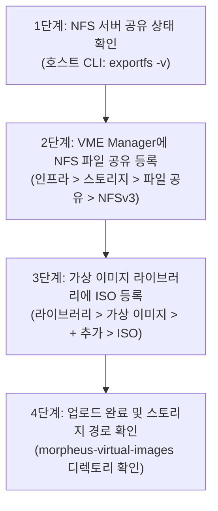

> **작성자**: 16년 차 IT 필드 엔지니어 (CK notes)  
> **기준 환경**: HPE Morpheus VM Essentials (VME) / HPE SimpliVity 6.2.0 (HVM 24.04 BaseOS)  
> **참조 매뉴얼**: SimpliVity ISO 이미지 등록 방법 가이드

---

안녕하세요! 16년 차 IT 필드 시스템 엔지니어 **CK notes**입니다.

HPE SimpliVity 6.2.0 및 HPE Morpheus VM Essentials(VME) 클러스터 배포를 완료했다면, 이제 인프라 위에 실제 업무를 담당할 **가상머신(VM, Instance)들을 생성하고 OS(Linux, Windows 등)를 설치할 준비**를 해야 합니다.

VM Essentials 환경에서 가상머신을 생성하여 운영체제를 설치하기 위해서는 **OS 설치용 ISO 파일을 VME 가상 이미지 라이브러리에 등록**해야 하며, 이 대용량 ISO 파일들이 안정적으로 저장되고 모든 호스트에서 공유될 수 있도록 **NFS 파일 공유 스토리지(File Share)**가 VME Manager에 미리 연동되어 있어야 합니다.

이번 포스팅에서는 **[Step 1]에서 구축했던 관리서버의 NFS 공유 폴더를 VME Manager의 이미지 스토어로 등록하는 방법부터, Ubuntu 22.04/Windows ISO 이미지를 업로드하고 실제 파일 저장 경로를 검증하는 전체 절차(총 9개 실전 UI 스크린샷)**를 알기 쉽게 정리해 드리겠습니다!

---

## 1. ISO 이미지 등록 및 NFS 연동 전체 워크플로우

VME Manager에 ISO 가상 이미지를 등록하는 과정은 **스토리지 백엔드 준비 ➔ 파일 공유 등록 ➔ ISO 업로드 ➔ 저장소 검증**의 4단계로 구성됩니다.



---

## 2. 16년 차 엔지니어의 핵심 실무 팁 3가지

> [!TIP]
> **💡 실무 팁 1: '기본 가상 이미지 스토어' 체크박스는 필수!**  
> VME Manager에서 NFS 파일 공유를 등록할 때, 하단의 **`[✔] 기본 가상 이미지 스토어 (Default Virtual Image Store)`** 체크박스를 반드시 활성화해야 합니다. 이 옵션을 켜두어야 향후 가상 이미지 업로드 시 해당 NFS가 기본 저장 버킷으로 자동 지정되며, 클러스터 내 모든 호스트가 VM 프로비저닝 시 해당 스토리지를 원활하게 참조할 수 있습니다.

> [!IMPORTANT]
> **💡 실무 팁 2: NFS 권한 설정 (`no_root_squash` 필수)**  
> VME Manager가 NFS 서버에 ISO 파일을 업로드하고 내부 폴더를 생성할 때 쓰기 권한 에러가 발생하지 않으려면, [Step 1] 관리서버의 `/etc/exports` 설정에서 반드시 **`rw,no_root_squash,no_subtree_check`** 옵션이 부여되어 있어야 합니다.

> [!NOTE]
> **💡 실무 팁 3: VME의 ISO 저장 디렉토리 구조 이해**  
> VME 웹 콘솔을 통해 ISO를 업로드하면, 지정된 NFS 내보내기 폴더(예: `/nfs`) 바로 아래에 저장되는 것이 아니라 **`/nfs/morpheus-virtual-images/<고유숫자ID>/<파일명.iso>`** 구조로 격리되어 안전하게 보관됩니다. 이 구조를 알고 있으면 CLI에서 직접 대용량 파일을 복사하거나 백업할 때 매우 유용합니다.

---

## 3. [Step by Step] ISO 이미지 등록 실전 가이드

---

### Step 01. NFS 서버 공유 상태 확인 (CLI)

먼저 [Step 1]에서 인프라 관리서버(Ubuntu BaseOS)에 구성해 둔 NFS 서비스가 정상적으로 공유 폴더(`/nfs`)를 서비스하고 있는지 터미널에서 확인합니다.

```bash
# NFS 익스포트 상태 확인
root@vmemgr:/home/vmeadmin# exportfs -v
```


* 출력 결과에 `/nfs <world>(sync,wdelay,hide,no_subtree_check,sec=sys,rw,insecure,no_root_squash,no_all_squash)`와 같이 정상 익스포트 옵션이 출력되는지 확인합니다.

---

### Step 02. VME Manager 스토리지 파일 공유 메뉴 진입

웹 브라우저에서 VM Essentials Manager 콘솔(`https://<VME_Manager_IP>`)에 접속한 후:
1. 상단 메뉴에서 **[인프라 (Infrastructure)] -> [스토리지 (Storage)]**로 이동합니다.
2. 상단 탭에서 **`파일 공유 (File Shares)`**를 선택합니다.
3. 우측의 **`[+ 추가]`** 드롭다운 버튼을 누르고 **`NFSv3`**를 클릭합니다.


---

### Step 03. 새 파일 공유 (NFS) 파라미터 입력

`새 파일 공유` 모달 창이 나타나면 다음과 같이 설정값을 입력합니다:


* **이름**: 식별하기 쉬운 스토리지 이름 입력 (예: `nfs`)
* **호스트**: NFS 서버 IP 주소 입력 ([Step 1] 관리서버 IP)
* **내보내기 폴더**: NFS 공유 디렉토리 경로 입력 (예: `/nfs`)
* **체크박스 옵션**:
  - **`[✔] 활성 (Active)`**: 체크
  - **`[ ] 기본 백업 타깃`**: 체크 해제 (백업용 전용 스토리지가 있을 경우 분리 권장)
  - **`[ ] 기본 배치 아카이브 타깃`**: 체크 해제
  - **`[✔] 기본 가상 이미지 스토어`**: **반드시 체크!**
* 입력을 마쳤다면 우측 하단의 **`[변경 사항 저장]`**을 클릭합니다.

---

### Step 04. 파일 공유 등록 완료 확인

파일 공유 목록으로 돌아오면 등록된 NFS 스토리지가 정상 표시됩니다:
* **이름**: `nfs`
* **제공자 유형**: `Nfs`
* **공유 경로**: `<NFS_서버_IP>:/nfs`


---

### Step 05. 가상 이미지 메뉴 진입 및 ISO 추가 선택

이제 ISO 파일을 업로드하기 위해 라이브러리 메뉴로 이동합니다:
1. 상단 메뉴에서 **[라이브러리 (Library)] -> [가상 이미지 (Virtual Images)]**로 이동합니다.
2. 우측 상단의 **`[+ 추가]`** 드롭다운 버튼을 클릭하고 **`ISO`**를 선택합니다.


---

### Step 06. 가상 이미지 업로드 정보 입력 & 버킷 선택

`가상 이미지 업로드` 창이 열리면 이미지 메타데이터를 입력합니다:


* **이름**: 가상머신 배포 시 표시될 이미지 이름 입력 (예: `Ubuntu 22.04` 또는 `Windows Server 2022`)
* **운영 체제**: 대상 OS 종류 선택 (예: `ubuntu 22.04 64-bit`)
* **최소 메모리**: 기본값 `0` MB 유지
* **버킷 (Bucket)**: 드롭다운에서 방금 Step 03에서 생성한 **`nfs`**를 선택합니다.
* **이미지 ID 생성**: **`● 파일`** 라디오 버튼 선택

---

### Step 07. 파일 업로드 및 고급(Advanced) 가상화 옵션 설정

화면 하단으로 스크롤하여 실제 ISO 파일을 등록하고 가상화 호환 옵션을 확정합니다:


1. **파일 추가**: 로컬 PC에 보관 중인 ISO 파일(예: `ubuntu-22.04.5-live-server-amd64.iso`)을 **`[파일 추가]`** 버튼으로 선택하거나 드롭박스 영역으로 드래그 앤 드롭합니다. 업로드 진행률 바가 100%에 도달할 때까지 대기합니다.
2. **고급 (Advanced) 옵션 확인**:
   - **`[✔] VIRTIO 드라이버가 로드되었습니까?`**: 리눅스 OS는 기본 탑재되어 있으므로 체크 (윈도우의 경우 VirtIO 드라이버 주입 여부 확인)
   - **`[✔] VM 도구가 설치되었습니까?`**: 체크
   - UEFI / Secure Boot / vTPM 필요 여부에 따라 해당 옵션을 체크합니다.
3. 설정을 마친 후 하단의 **`[변경 사항 저장]`** 버튼을 클릭합니다.

---

### Step 08. 가상 이미지 목록에서 업로드 완료 및 활성 상태 확인

라이브러리 가상 이미지 목록으로 돌아오면 방금 업로드한 ISO 파일이 성공적으로 등록되어 표시됩니다:
* **유형**: `ISO`
* **이름**: `Ubuntu`
* **플랫폼**: `ubuntu 22.04 64-bit`
* **크기**: 실제 파일 크기 (예: `2.0 GiB`)
* **소스**: `업로드됨`
* **상태**: **`활성 (Active)`**


---

### Step 09. 스토리지 파일 쉐어 실제 디렉토리 구조 검증

등록된 ISO가 NFS 스토리지 상에 어떤 경로로 저장되었는지 직접 확인해 봅니다:
* **[인프라] -> [스토리지] -> [파일 공유] -> `nfs`** 상세 화면으로 이동합니다.
* 하단의 `파일` 탐색기 영역을 확인하면:
  - **`nfs / morpheus-virtual-images / 19 / ubuntu-22.04.5-live-server-amd64.iso`**  
  형태로 VME가 고유 숫자 ID 폴더를 자동으로 생성하고 그 아래에 안전하게 ISO를 배치한 것을 확인할 수 있습니다!


---

## 4. 가상머신(VM) 생성 시 ISO 마운트 방법

이미지가 정상 등록되었으므로, 이제 가상머신을 프로비저닝할 때 자유롭게 해당 ISO를 마운트할 수 있습니다:

1. **[Provisioning] -> [Instances] -> [+ Add]** 메뉴를 실행합니다.
2. 인스턴스 유형 선택 시 **`KVM`** 또는 **`HVM`**을 지정합니다.
3. 스토리지 구성 단계에서 **`CD ROM`** 드라이브 항목에 방금 업로드한 **`Ubuntu (ISO)`**를 선택합니다.
4. 가상머신 부팅 시 해당 ISO로 즉시 진입하여 OS 설치를 시작할 수 있습니다.

---

## 5. 자주 묻는 질문 및 현장 트러블슈팅 (FAQ)

> [!WARNING]
> **Q1. 대용량 ISO(예: Windows Server 5GB+) 업로드 중 웹 브라우저 연결이 끊기거나 실패합니다.**  
> * **원인**: 웹 프록시나 로드밸런서의 클라이언트 바디 타임아웃(Client Body Timeout)이 짧게 설정된 경우 발생할 수 있습니다.  
> * **해결책**: VME Manager 웹 GUI 업로드 대신, 관리서버 터미널에서 SCP나 NFS 마운트를 통해 호스트의 `/nfs` 디렉토리에 직접 파일을 복사한 뒤, VME 이미지 등록 창에서 **`● URL/PATH`** 옵션(`file:///nfs/...`)을 사용하여 로컬 경로로 즉시 인덱싱하면 대용량 파일도 1초 만에 등록 가능합니다.

> [!WARNING]
> **Q2. 가상 이미지 상태가 '오류(Error)' 또는 '업로드 실패'로 표시됩니다.**  
> * **원인**: NFS 서버의 디스크 용량이 부족하거나, 파일 권한(`Permission Denied`) 문제로 VME 서비스 계정이 `morpheus-virtual-images` 폴더를 생성하지 못한 경우입니다.  
> * **해결책**: NFS 서버 터미널에서 `df -h /nfs`로 여유 공간을 점검하고, `chmod -R 777 /nfs` 명령으로 권한을 일시 개방하여 권한 문제를 해소하세요.

---

## 6. 결론 및 요약

이로써 HPE SimpliVity 및 VME 환경에서 **NFS 스토리지를 파일 공유로 연동하고 가상머신용 ISO 이미지를 등록하는 전 과정**이 완료되었습니다!

### 📌 오늘의 핵심 정리
1. **NFS 연동 시 `기본 가상 이미지 스토어` 활성화**: 모든 VM 프로비저닝 시 자동으로 해당 스토리지를 바라보게 합니다.
2. **NFS 디렉토리 계층 구조 이해**: VME는 `/nfs/morpheus-virtual-images/<ID>/` 형태로 이미지를 체계적으로 분류 저장합니다.
3. **VM 배포 가속화**: 등록된 ISO를 통해 언제든 원하는 스펙의 Ubuntu, Windows 가상머신을 몇 번의 클릭만으로 손쉽게 배포할 수 있습니다.

---

궁금하신 점이나 구축 관련 질문은 언제든 댓글로 남겨주시면 친절히 답변드리겠습니다!
