> **Author**: 16-year IT Field Systems Engineer (CK notes)  
> **Environment**: HPE Morpheus VM Essentials (VME) / HPE SimpliVity 6.2.0 (HVM 24.04 BaseOS)  
> **Reference Guide**: HPE-VM Network Addition Operation Guide v2.0

---

Hello! I am **CK notes**, an IT field systems engineer with 16 years of experience.

After deploying virtualization infrastructure based on HPE VM Essentials (VME) or HPE SimpliVity HVM, you inevitably need to **connect dedicated production service data networks or additional VLANs in addition to the default Management network** before putting virtual machines (VMs) into production.

However, many engineers often encounter confusion regarding **"how to configure bonding at the physical host level (HPE VM Console TUI)"**, **"the procedure to register OVS (Open vSwitch) network routers in VME Manager web console"**, and **"how to design networks in a single NIC environment to prevent future headaches."**

In this post, we walk through the **7 steps of creating host network bonds in HPE VM Console and the 4 steps of registering routers in VME Manager and assigning them to VMs (with 11 real-world screenshots)**.  
Furthermore, we reveal our essential field tip: **"Why you MUST configure bonding even in a single NIC environment"**, along with practical **OVS ghost port error troubleshooting techniques**!

---

## 1. End-to-End Workflow for HPE VME & SimpliVity Network Addition

Adding a new network to an HVM host and attaching it to virtual machines spans **two layers (Physical Host TUI ➔ VME Web Console)**.

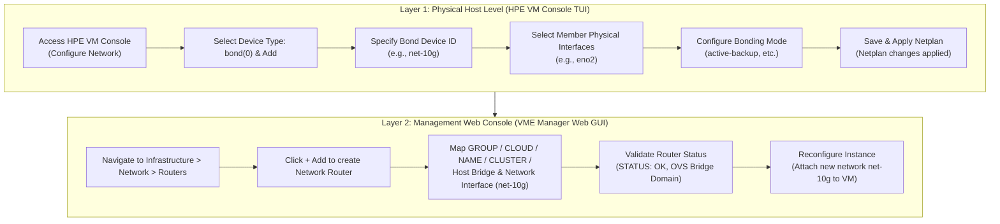

---

## 2. 16-Year Field Engineer Pro-Tip: "Even with a Single NIC, ALWAYS Configure as a Bond!"

During field deployments, due to top-of-rack L2/L3 switch port shortages or cabling schedules, you often face situations where you must open services with **only one physical cable/NIC (e.g., `eno2`) initially connected**.

The most common rookie mistake here is: **"Since there is only one cable, let's configure Device Type as `ethernet` and bind `eno2` directly to the OVS bridge."**

> [!WARNING]
> **🚨 Critical Problems Caused by Binding a Single NIC as a Raw `ethernet` Device**  
> Later, when additional switch ports become available and you run a second cable to establish **High Availability (HA) redundancy, you must delete and recreate the existing OVS bridge and virtual machine network mappings.** This inevitably causes **downtime for running production virtual machines!**

### 💡 3 Field Reasons to Wrap Single Ports in a `bond` (active-backup)

1. **Zero-Downtime HA Scalability**  
   If you create the device as a `bond` (Device ID: `net-10g`, Mode: `active-backup`, Interface: `eno2`) from day one, when the secondary redundant cable (`eno3`) is installed later, **you never touch the OVS bridge or VM configuration. You simply add `eno3` to the bond member interface list, achieving zero-downtime instant HA upgrade!**
2. **Invariance of OVS Bridge & VME Manager Mappings**  
   The VME Manager web console only references the logical interface `net-10g` (Bond). Even if the underlying physical NIC count expands from 1 to 2 or swaps to different physical ports, the router mapping and VM vNIC configurations in VME remain completely untouched.
3. **Standardized Failover Infrastructure**  
   Enforcing consistent `bond` naming conventions (e.g., `bond0`, `net-10g`, `net-service`) across all virtualization hosts standardizes operational automation and maintenance.

> [!TIP]
> **📌 Conclusion**: Whether you have 1 physical port or 2, always define **Device Type as `bond` with `active-backup` mode** on HVM hosts. This is the gold standard of systems engineering.

---

## 3. [Part 1] HPE VM Console (TUI) Host Network Bonding Configuration (7 Steps)

From the HVM host console (via iLO Remote Console or physical monitor/keyboard), launch the text-based user interface (TUI) **HPE VM Console** to configure network bonding.

### Step 01. Enter HPE VM Console & Select Configure Network
From the main menu, use arrow keys to navigate to **`<Configure Network>`** and press Enter.

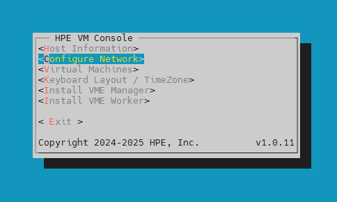

### Step 02. Select `bond(0)` in Device Type & Click `<Add>`
In the Configure Network screen, select **`bond(0)`** from the Device Type dropdown and click **`<Add>`** at the bottom.

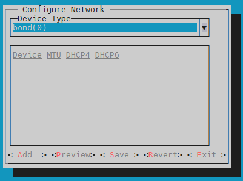

### Step 03. Assign Bond Device ID
When the `Add Device` modal opens, verify Device Type is `bond`, enter your **Device ID (e.g., `net-10g` or `bond1`)**, and click **`<Continue>`**.

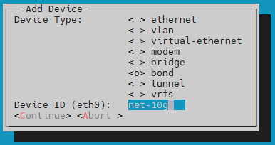

### Step 04. Select Member Physical Interfaces for the Bond
Under the `Bond` tab in `Edit Device`, navigate to **`[ ] interfaces`**, toggle the spacebar to check member physical interfaces (e.g., **`eno2`**), and click `<Done>`.  
*(※ Even if you only have one physical port right now, check eno2 alone to create the bond!)*

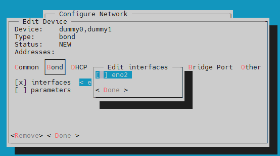

### Step 05. Configure Bonding Mode and Parameters
In `Edit parameters`, choose the bonding mode:
* For single switch or single NIC environments, select the rock-solid **`mode: active-backup`**.
* If switch LACP dynamic trunking is configured, select `802.3ad` (LACP).
* Click **`<Done>`** when finished.

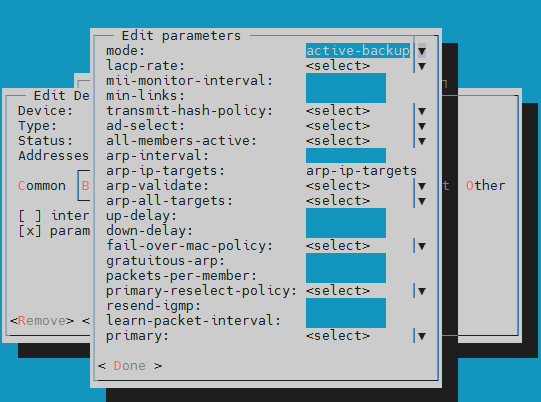

### Step 06. Save and Confirm Netplan Configuration
Return to the Configure Network main screen and click **`<Save>`**.  
In the confirmation popup: "Netplan changes may result in a disconnect. Are you sure you want to continue?", select **`<Yes>`**.

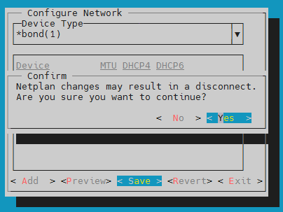

### Step 07. Netplan Applied OK
Once the Linux network stack accepts the configuration, a **`Netplan changes applied`** message appears. Click **`<OK>`**, exit the console, and proceed to the VME Manager web console.

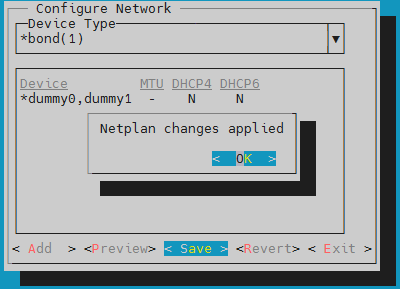

---

## 4. [Part 2] Registering Router in VME Manager & Assigning to VM (4 Steps)

With the `net-10g` bond interface active on the host OS, we now register it as a logical OVS network router in VM Essentials Manager and map it to a VM.

### Step 08. Navigate to Infrastructure > Network > Routers & Click `+ Add`
Log in to VME Manager (`https://<VME_Manager_IP>`), go to **[Infrastructure] -> [Network] -> [Routers]**, and click the green **`[+ Add]`** button.

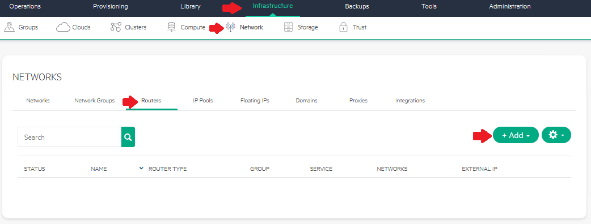

### Step 09. Configure Router Parameters & Map Host Bridge / Interface
Fill in the `ADD NETWORK ROUTER` modal as follows:

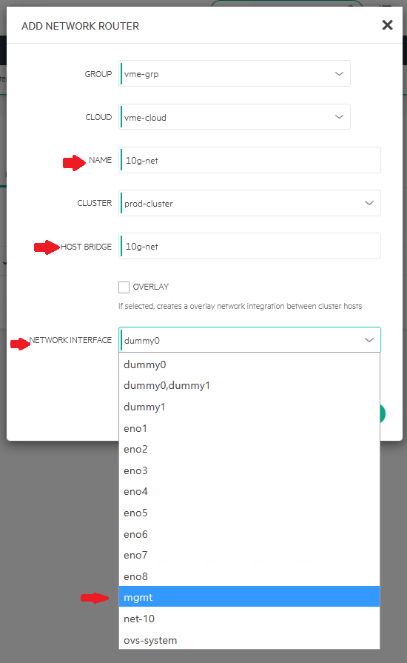

* **GROUP**: Target management group (e.g., `vme-grp`)
* **CLOUD**: Target cloud environment (e.g., `vme-cloud`)
* **NAME**: Identification router name in VME (e.g., `10g-net`)
* **CLUSTER**: Target HVM cluster (e.g., `prod-cluster`)
* **HOST BRIDGE**: Unique Open vSwitch bridge name (e.g., `10g-net`)
* **NETWORK INTERFACE**: Select the bonding interface created in Part 1 (e.g., **`net-10`** or **`dummy0`**).

> [!CAUTION]
> **⚠️ Avoid Duplicate OVS Bridge Names**  
> In Open vSwitch, specifying an existing bridge name (such as the default management bridge `mgmt` or an existing `192-net`) will cause a collision and fail router creation. Always assign a unique bridge identifier.

### Step 10. Verify Created Network Router Status
Once created, the router displays in the list:
* **STATUS**: Green checkmark (Active)
* **NAME**: `net-10g`
* **ROUTER TYPE**: **`OVS Bridge Domain`**
* **GROUP**: Bound to the assigned group

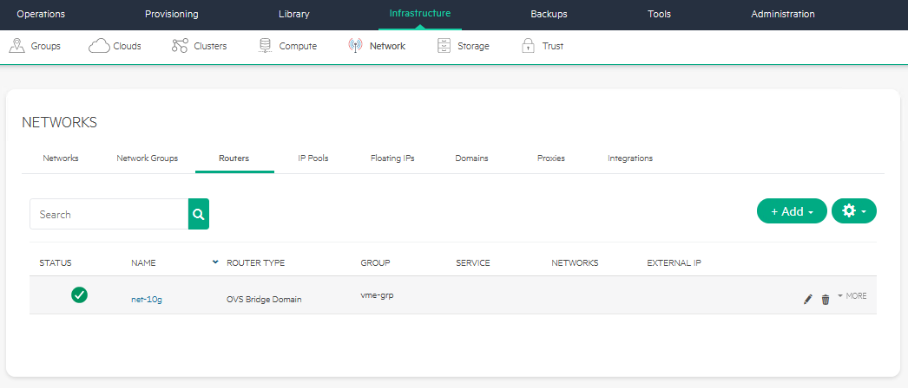

### Step 11. Attach New Network to Virtual Machine Instance
Attach the new network to your target VM:
1. Go to **[Provisioning] -> [Instances]** and select the VM.
2. In the top-right actions menu, click **`Reconfigure`**.
3. Under **`NETWORKS`**, click the **`+`** button.
4. Select **`net-10g`** from the dropdown and set the IP addressing mode (DHCP or Static IP).
5. Click **`[Reconfigure]`** to instantly mount the new virtual NIC (vNIC).

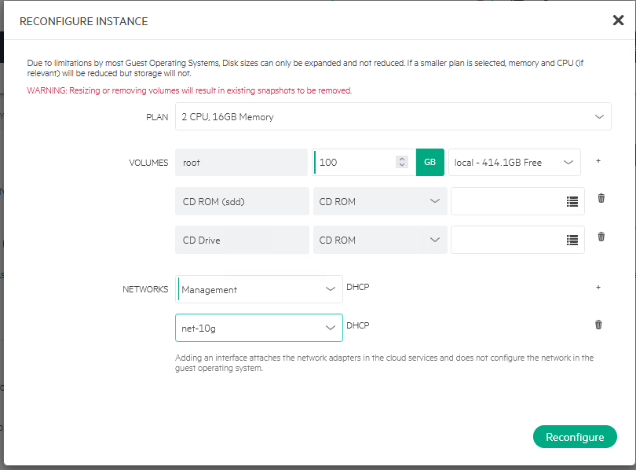

---

## 5. Special Considerations for SimpliVity VME Environments

In **HPE SimpliVity 6.2.0 (HVM) cluster environments**, strict network segregation rules must be maintained:

```
+-----------------------------------------------------------------------+
|                       HPE SimpliVity Physical Node                    |
|                                                                       |
|  [ Dedicated 10G/25G PCIe NICs ] --> SimpliVity OVC (Storage Ctrl)   |
|   - Storage Network (MTU 9000, VLAN 151): Synchronous block mirror     |
|   - Federation Network (MTU 9000, VLAN 153): Cluster metadata          |
|   * Strictly prohibited from sharing with regular VM traffic!         |
|                                                                       |
|  [ Onboard LOM / Extra NICs (eno1~eno4) ] --> New OVS Bond (net-10g)  |
|   - Workload Virtual Machines service & production data traffic       |
+-----------------------------------------------------------------------+
```

1. **Mandatory Isolation of OVC Storage / Federation Traffic**  
   SimpliVity OmniStack Virtual Controller (OVC) exclusively utilizes dedicated 10GbE interfaces (`ens21f0np0`, `ens21f1np1`) with Jumbo Frames (MTU 9000) for inline deduplication and real-time block replication.  
   **Never mix or share OVC storage NICs with general workload VM networks.** Always bind service networks to onboard LOM ports (`eno1`–`eno4`) or separate PCIe NICs.
2. **Uniform Bridge Topology Across All Cluster Nodes**  
   For seamless live migration (vMotion) and HA failover across a 2-node or multi-node SimpliVity cluster, ensure identical bond device names and OVS bridge names are deployed across every physical host in the cluster.

---

## 6. Field Troubleshooting & Advanced Engineering Tips

### 🛠️ Troubleshooting 1: Cleaning Up OVS Ghost Port Errors (`could not open network device vnetX`)

When deleting or reconfiguring VMs, unexpected guest termination can leave orphaned ghost virtual ports on OVS bridges:

```text
root@vmemgr:/home/vmeadmin# ovs-vsctl show
4ea92630-835f-4664-83bc-01936dc54090
    Bridge mgmt
        fail_mode: standalone
        Port eno2
            Interface eno2
        Port vnet17
            Interface vnet17
                error: "could not open network device vnet17 (No such device)"
        Port vnet2
            Interface vnet2
                error: "could not open network device vnet2 (No such device)"
        Port vnet3
            Interface vnet3
                error: "could not open network device vnet3 (No such device)"
        Port mgmt
            Interface mgmt
                type: internal
```

#### ✅ Resolution: Manually Remove Ghost Ports with `ovs-vsctl del-port`
Remove the failed vnet ports from the bridge:

```bash
# Delete orphaned vnet ports from mgmt bridge
sudo ovs-vsctl del-port mgmt vnet17
sudo ovs-vsctl del-port mgmt vnet2
sudo ovs-vsctl del-port mgmt vnet3

# Verify OVS status
ovs-vsctl show
```
The error messages clear, leaving only valid ports (`eno2`, `vnet0`, `vnet1`, `mgmt`).

---

### 💡 Advanced Tip 2: Using Linux Dummy Interfaces for Pre-Cabling Verification

If switch cabling is delayed or you are building in a lab environment, use the Linux **`dummy` kernel module** to simulate network interfaces:

```bash
# 1) Load dummy kernel module
sudo modprobe dummy

# 2) Create two dummy interfaces
sudo ip link add dummy0 type dummy
sudo ip link add dummy1 type dummy

# 3) Assign test IP addresses
sudo ip addr add 10.10.10.1/32 dev dummy0
sudo ip addr add 10.10.20.1/32 dev dummy1

# 4) Bring interfaces UP
sudo ip link set dummy0 up
sudo ip link set dummy1 up
```

`dummy0` and `dummy1` will immediately appear in the VME Manager `Network Interface` dropdown, enabling full end-to-end simulation before physical cables arrive!

---

## 7. Conclusion & Summary

Network expansion in HPE VME and SimpliVity harmonizes **standardized bonding at the physical host layer (HPE VM Console)** with **flexible OVS router mapping at the virtualization management layer (VME Manager)**.

### 📌 Top 3 Key Takeaways
1. **Always Bond Even Single NICs (`active-backup`)**: Enables zero-downtime secondary cable addition and seamless HA scaling.
2. **Ensure Unique OVS Bridge Names**: Avoid name collisions with existing management bridges like `mgmt`.
3. **SimpliVity Network Segregation**: Keep OVC 10G Jumbo Frame (MTU 9000) storage backbones strictly isolated from workload VM networks.

---

Feel free to leave questions or real-world networking challenges in the comments below!
