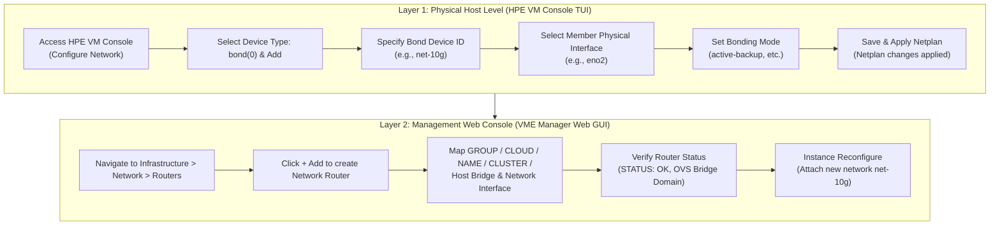

> **Environment**: HPE Morpheus VM Essentials (VME) / HPE SimpliVity 6.2.0 (HVM 24.04 BaseOS)  
> **Reference Guide**: HPE-VM Network Addition Operation Guide v2.0

---

After initial deployment of an HPE SimpliVity HVM or VME (VM Essentials) cluster, only the default Management network is configured. Putting production workload virtual machines (VMs) into service requires adding dedicated data networks or tenant VLANs.

The deployment workflow consists of two primary stages: creating a network bond interface at the physical host layer (via HPE VM Console TUI), and then mapping it as an Open vSwitch (OVS) network router within the VME Manager web console to attach to VMs.

This guide outlines the standard operating procedure from TUI host bonding to VME router mapping and VM vNIC provisioning. It also highlights a crucial field design practice—why you should always encapsulate single physical links in a bond interface—as well as practical troubleshooting steps for lingering OVS ghost port errors.

---

## 1. End-to-End Workflow

Adding an external network to HVM hosts and attaching it to VMs is cleanly separated between the physical host and virtualization management layers.



---

## 2. Field Design Practice: Why Single NIC Environments Still Require Bonding

During physical rollouts, upstream switch ports may not yet be provisioned, or rack cabling delays might require bringing up services with only a single physical link (e.g., `eno2`).

A common pitfall in this situation is configuring the interface directly as a raw `ethernet` device and attaching it straight to the OVS bridge.

> [!WARNING]
> **Drawback of Direct Single Ethernet Devices**  
> When the secondary switch port becomes available later and you want to implement high-availability (HA) teaming, you will have to tear down and rebuild the existing OVS bridge and all attached VM network mappings. This inevitably causes unnecessary service downtime for production workloads.

### Key Operational Reasons to Use `bond` (active-backup) for Single Links

1. **Zero-Downtime HA Scalability**  
   Even with a single cable, creating a `bond` (Device ID: `net-10g`, Mode: `active-backup`, Interface: `eno2`) establishes an extensible logical abstraction. When the secondary link (`eno3`) is patched later, you simply add `eno3` to the bond members without touching the OVS bridge or restarting VMs.
2. **Configuration Immutability in VME Manager**  
   VME Manager binds to the higher-level logical device (`net-10g`). Physical NIC additions, swaps, or driver adjustments beneath the bond remain transparent to VME router bindings and VM vNIC configurations.
3. **Operational Consistency**  
   Standardizing all host network devices under consistent bond naming conventions (e.g., `bond0`, `net-10g`) simplifies long-term maintenance, documentation, and automation playbooks.

> [!TIP]
> Regardless of whether you currently have one or two cables connected, configuring host interfaces as a `bond` in `active-backup` mode is the enterprise standard.

---

## 3. [Part 1] HPE VM Console (TUI) Host Network Bonding Configuration

Connect to the HVM host console (via iLO Remote Console or physical KVM) to configure bonding using the text-based HPE VM Console.

### Step 01. Enter Configure Network Menu
On the HPE VM Console home screen, select `<Configure Network>` using arrow keys and press Enter.


### Step 02. Select `bond(0)` Device Type and `<Add>`
From the Device Type dropdown, select `bond(0)` and select `<Add>`.


### Step 03. Specify Bond Device ID
In the Add Device modal, confirm that Device Type is `bond`, enter the desired Device ID (e.g., `net-10g`), and click `<Continue>`.


### Step 04. Select Member Physical Interfaces
Under the Bond tab in Edit Device, navigate to `[ ] interfaces`, select the physical interface (e.g., `eno2`) with the Space bar, and click `<Done>`.  
*(※ Even in single link scenarios, select just `eno2` and proceed.)*


### Step 05. Configure Bonding Mode
In the Edit parameters screen, select the bonding operation mode:
* For standard active-passive redundancy or single NIC deployments, select `mode: active-backup`.
* If upstream switches have pre-configured LACP trunks, select `802.3ad`.
* Click `<Done>` when finished.


### Step 06. Save Netplan Configuration
Return to Configure Network and click `<Save>`. Confirm with `<Yes>` when prompted that Netplan changes may cause a disconnect.


### Step 07. Verify Netplan Applied Successfully
Once Linux network configuration completes, `Netplan changes applied` is displayed. Click `<OK>` to exit the console.


---

## 4. [Part 2] VME Manager Web Console: Router Registration & VM Attachment

With `net-10g` active at the host OS layer, register it as a logical router in VME Manager and attach it to virtual instances.

### Step 08. Navigate to Network > Routers and Click `+ Add`
Log into VME Manager (`https://<VME_Manager_IP>`), navigate to **[Infrastructure] -> [Network] -> [Routers]**, and click the green `[+ Add]` button.


### Step 09. Configure Router Parameters & Interface Mapping
In the ADD NETWORK ROUTER modal, enter the configuration details:


* **GROUP**: Target management group (e.g., `vme-grp`)
* **CLOUD**: Connected cloud environment (e.g., `vme-cloud`)
* **NAME**: Identifier for the router (e.g., `10g-net`)
* **CLUSTER**: Target HVM cluster (e.g., `prod-cluster`)
* **HOST BRIDGE**: Name for the OVS bridge (e.g., `10g-net`)
* **NETWORK INTERFACE**: Select the bond interface created in Part 1 (e.g., `net-10` or test `dummy0`).

> [!CAUTION]
> **Avoid OVS Bridge Name Collisions**  
> Do not use names of existing bridges on the host (such as the default management bridge `mgmt`). Duplicate bridge names will cause router provisioning to fail.

### Step 10. Verify Router Status
Once provisioned, the new router appears in the Routers list:
* **STATUS**: Green checkmark (Active/OK)
* **NAME**: Assigned router name (`net-10g`)
* **ROUTER TYPE**: `OVS Bridge Domain`
* **GROUP**: Correct management group binding


### Step 11. Attach Network to Virtual Machine
Attach the new network to your workload instances:
1. Navigate to **[Provisioning] -> [Instances]** and select the target VM.
2. In the instance details view, click `Reconfigure` from the top-right action menu.
3. In the `NETWORKS` section, click the `+` button.
4. Select `net-10g` from the network dropdown and configure IP addressing (DHCP or Static).
5. Click `[Reconfigure]` to dynamically attach the virtual NIC.


---

## 5. Network Separation Considerations for SimpliVity HVM Clusters

Unlike standalone HVM nodes, **HPE SimpliVity 6.2.0 (HVM) clusters** require strict physical isolation between workload traffic and storage backbones.

```
+-----------------------------------------------------------------------+
|                       HPE SimpliVity Physical Node                    |
|                                                                       |
|  [ Dedicated 10G/25G PCIe NIC ] ---> SimpliVity OVC Storage Controller|
|   - Storage Network (MTU 9000, VLAN 151) : Real-time block replication|
|   - Federation Network (MTU 9000, VLAN 153) : Cluster metadata        |
|   * Workload VM traffic is strictly prohibited on these links!        |
|                                                                       |
|  [ Onboard LOM / Extra PCIe NIC (eno1~eno4) ] --> OVS Bond (net-10g)  |
|   - Production Workload VM Application Traffic                       |
+-----------------------------------------------------------------------+
```

1. **Isolate OVC Storage & Federation Interfaces**  
   OmniStack Virtual Controllers (OVC) use dedicated 10GbE interfaces (`ens21f0np0`, `ens21f1np1`) with jumbo frames (MTU 9000) for real-time deduplication and synchronous mirroring. Never share OVC storage interfaces with VM workloads. Use separate onboard LOM ports (`eno1`–`eno4`) or dedicated workload PCIe NICs.
2. **Maintain Identical Bridge Topology Across All Cluster Nodes**  
   To ensure seamless VM live migrations (vMotion), create identical bond names and OVS bridge configurations across every host in the cluster.

---

## 6. Field Troubleshooting: Clearing OVS Ghost Ports

If a virtual machine crashes or is deleted improperly, orphaned virtual interfaces (ghost ports) may linger inside the Open vSwitch database, generating errors.

Running `ovs-vsctl show` on the host CLI may display:

```text
root@vmemgr:/home/vmeadmin# ovs-vsctl show
4ea92630-835f-4664-83bc-01936dc54090
    Bridge mgmt
        fail_mode: standalone
        Port eno2
            Interface eno2
        Port vnet17
            Interface vnet17
                error: "could not open network device vnet17 (No such device)"
        Port vnet2
            Interface vnet2
                error: "could not open network device vnet2 (No such device)"
        Port vnet3
            Interface vnet3
                error: "could not open network device vnet3 (No such device)"
        Port mgmt
            Interface mgmt
                type: internal
```

You can cleanly resolve this by manually pruning the stale ports from the bridge:

```bash
# Delete orphaned vnet ports
sudo ovs-vsctl del-port mgmt vnet17
sudo ovs-vsctl del-port mgmt vnet2
sudo ovs-vsctl del-port mgmt vnet3

# Verify OVS status
ovs-vsctl show
```

After removal, `ovs-vsctl show` will reflect a clean bridge state containing only active ports (`eno2`, `mgmt`).

---

## 7. Summary

Network provisioning in HPE VME and SimpliVity clusters hinges on standard host-level bonding paired with flexible VME OVS router abstraction.

The workflow is straightforward, but adhering to two core practices—**bonding even single links from day one** and **strictly isolating storage backbone fabrics**—ensures reliable long-term operations and non-disruptive capacity expansion.
