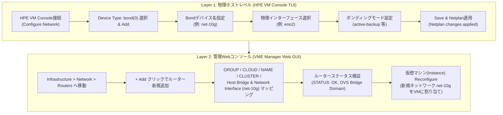

> **作成者**: 16年目のITフィールドエンジニア (CK notes)  
> **基準環境**: HPE Morpheus VM Essentials (VME) / HPE SimpliVity 6.2.0 (HVM 24.04 BaseOS)  
> **参照マニュアル**: HPE-VM ネットワーク追加作業ガイド v2.0

---

こんにちは！16年目のITフィールドシステムエンジニア **CK notes** です。

HPE VM Essentials(VME)仮想化基盤やHPE SimpliVity HVM環境を構築した後、仮想マシン(VM)を本番業務サービスに投入するには、**標準の管理ネットワーク(Management)に加えて、業務データ用ネットワークや追加VLANを接続する作業**が不可欠です。

しかし、多くのエンジニアが**「物理ホストレベル(HPE VM Console TUI)でボンディングを設定する方法」**、**「VME Manager WebコンソールでOVS(Open vSwitch)ネットワークルーターとして登録する手順」**、そして**「単一物理ポートしか接続できないシングルネットワーク環境で将来の障害を防ぐ設計法」**について戸惑うことがあります。

本記事では、**HPE VM Consoleでのホストネットワークボンディング(Bond)作成7ステップから、VME Manager Webコンソールでのルーター登録およびVM割り当て4ステップ（合計11枚の実践スクリーンショット）**を詳しく解説します。  
さらに、16年の現場経験で培った**「シングルNIC環境でも必ずボンディングで構成すべき理由」**や、**OVSゴーストポートエラーのトラブルシューティング手法**まで余すところなく公開します！

---

## 1. HPE VME & SimpliVity ネットワーク追加全体ワークフロー

HVMホストに新しいネットワークを追加し仮想マシンに接続する流れは、**2つのレイヤー（物理ホストTUI ➔ VME Webコンソール）**で進行します。



---

## 2. 16年目エンジニアの実践設計Tips: 「シングルNIC(単一ポート)でも必ずボンディング(Bonding)で構成せよ！」

現場での構築作業中、上位L2/L3スイッチの空きポート不足やケーブリング日程の都合により、まずは**1本の物理ポート(例: `eno2`)のみを接続してサービスを開始しなければならない状況**に直面することがよくあります。

このとき、初級エンジニアが陥りがちなミスが**「どうせ線は1本だから、Device Typeを`ethernet`にして`eno2`をOVSブリッジに直結してしまうこと」**です。

> [!WARNING]
> **🚨 シングルNICを`ethernet`単一デバイスとして直接構成した場合の致命的な問題点**  
> 後日スイッチポートが確保され、2本目のケーブルを接続して**ネットワーク冗長化(HA)を構成しようとする際、既存のOVSブリッジと仮想マシンネットワーク設定をすべて削除して再作成しなければなりません。** これは必然的に**稼働中仮想マシンのサービス停止（ダウンタイム）**を引き起こします！

### 💡 単一ポートでも`bond` (active-backup)で包むべき3つの理由

1. **無停止（Zero-Downtime）でのHA冗長化拡張**  
   初めは物理ポートが1本だけでも`bond` (Device ID: `net-10g`, Mode: `active-backup`, Interface: `eno2`)として作成しておけば、後から冗長ケーブル(`eno3`)が配線された際、**OVSブリッジや仮想マシン設定を変更することなく、単にBondメンバーリストに`eno3`を追加するだけで即座に無停止冗長化が完了**します。
2. **OVSブリッジおよびVME Manager設定の不変性維持**  
   VME Manager Webコンソールでは上位論理インターフェースである`net-10g` (Bond)のみを参照しているため、下位の物理NICが1本から2本に拡張されたり別ポートに交換されたりしても、VME側のルーターマッピングやVMのvNIC設定は完全に保持されます。
3. **フェイルオーバー構成の標準化**  
   すべての仮想化ホストでネットワークデバイスを`bond`命名規則（例: `bond0`, `net-10g`, `net-service`）に統一することで、運用保守および自動化スクリプトの整合性が保たれます。

> [!TIP]
> **📌 結論**: 物理ポートが1本でも2本でも、HVMホストレベルでは**常にDevice Typeを`bond`とし、`active-backup`モードで構成する**のがプロエンジニアの鉄則です。

---

## 3. [Part 1] HPE VM Console (TUI) ホストネットワークボンディング構成 7ステップ

HVMホストのコンソール（iLOリモートコンソールまたは物理モニタ/キーボード）から、テキストベースUIである**HPE VM Console**を使用してネットワークボンディングを作成します。

### Step 01. HPE VM Console 起動 & Configure Network 選択
メインメニューで方向キーを使って**`<Configure Network>`**を選択し、Enterを押します。


### Step 02. Device Type で `bond(0)` を選択し `<Add>` をクリック
Configure Network画面の`Device Type`ドロップダウンから**`bond(0)`**を選択し、下部の**`<Add>`**ボタンを押します。


### Step 03. ボンディングデバイス名(Device ID)の指定
`Add Device`ウィンドウが表示されたら、Device Typeが`bond`であることを確認し、使用する**Device ID（例: `net-10g` または `bond1`）**を入力して**`<Continue>`**をクリックします。


### Step 04. Bond に含める物理インターフェースの選択
`Edit Device`画面の`Bond`タブで**`[ ] interfaces`**を選択し、ボンディングに含める物理インターフェース（例: **`eno2`**）をスペースキーでチェックして`<Done>`を押します。  
*(※ 前述のTipsどおり、物理ポートが1本だけでもeno2のみをチェックしてBondを作成します。)*


### Step 05. ボンディングモード(Bonding Mode)の設定
`Edit parameters`メニューでボンディング動作モードを指定します。
* 単一スイッチやシングルNIC環境では、最も安定した**`mode: active-backup`**を選択します。
* 対向スイッチでLACPトランクが構成されている場合は`802.3ad` (LACP)を選択します。
* 設定後、下部の**`<Done>`**をクリックします。


### Step 06. Netplan設定の保存(Save)および確認
Configure Networkメインに戻り、下部の**`<Save>`**をクリックします。  
「Netplan changes may result in a disconnect. Are you sure you want to continue?」ポップアップで**`<Yes>`**を選択します。


### Step 07. Netplan適用完了 (Applied OK)
Netplan設定が正常に反映されると、**`Netplan changes applied`**メッセージが表示されます。**`<OK>`**を押してコンソールを終了し、VME Manager Webコンソールへ移動します。


---

## 4. [Part 2] VME Manager Webコンソールでのルーター登録 & VM割り当て 4ステップ

ホストOSレベルで`net-10g`ボンディングインターフェースが有効化されたので、VME Manager Webコンソールで論理OVSネットワークルーターとして登録し、仮想マシンに接続します。

### Step 08. Infrastructure > Network > Routers メニューで `+ Add` をクリック
WebブラウザでVME Manager（`https://<VME_Manager_IP>`）にログインし、**[Infrastructure] -> [Network] -> [Routers]**タブへ移動します。右上の緑色の**`[+ Add]`**ボタンをクリックします。


### Step 09. ルーター情報の入力および Host Bridge / Interface マッピング
`ADD NETWORK ROUTER`モーダルで各項目を入力します:


* **GROUP**: ルーターが属する管理グループ（例: `vme-grp`）
* **CLOUD**: 連携クラウド環境（例: `vme-cloud`）
* **NAME**: VME上で識別するルーター名（例: `10g-net`）
* **CLUSTER**: 対象HVMクラスタ（例: `prod-cluster`）
* **HOST BRIDGE**: 作成するOpen vSwitchブリッジ名（例: `10g-net`）
* **NETWORK INTERFACE**: ドロップダウンから[Part 1]で作成したボンディングインターフェース（例: **`net-10`** または **`dummy0`**）を選択します。

> [!CAUTION]
> **⚠️ OVSブリッジ名の重複禁止 (Bridge Name Conflict)**  
> Open vSwitch環境では、ホスト内に既に存在するブリッジ名（デフォルト管理ブリッジの`mgmt`や既存の`192-net`など）と同一の名前を指定すると競合が発生し、ルーター作成に失敗します。必ず一意のBridge名を指定してください。

### Step 10. 作成されたネットワークルーターステータスの検証
作成が完了すると、Routers一覧に表示されます:
* **STATUS**: 緑色のチェックアイコン（正常アクティブ）
* **NAME**: `net-10g`
* **ROUTER TYPE**: **`OVS Bridge Domain`**
* **GROUP**: 所属グループ正常バインド確認


### Step 11. 仮想マシンインスタンス(VM)への新規ネットワーク割り当て
仮想マシンに新しいネットワークを割り当てます:
1. **[Provisioning] -> [Instances]**で対象VMを選択します。
2. 右上のアクションメニューから**`Reconfigure`**をクリックします。
3. `RECONFIGURE INSTANCE`画面の**`NETWORKS`**セクションで右側の**`+`**ボタンを押します。
4. 追加されたプルダウンから先ほど作成した**`net-10g`**を選択し、IP割り当て方式（DHCPまたはStatic IP）を指定します。
5. 右下の**`[Reconfigure]`**をクリックすると、VMに新しい仮想NIC(vNIC)が即座にマウントされます。


---

## 5. SimpliVity VME 環境構築時の特別考慮事項

**HPE SimpliVity 6.2.0 (HVM) クラスタ環境**では、ネットワーク追加時に以下のトラフィック分離原則を厳守する必要があります。

```
+-----------------------------------------------------------------------+
|                       HPE SimpliVity 物理ノード                        |
|                                                                       |
|  [ 専用 10G/25G PCIe NIC ] ------> SimpliVity OVC (ストレージ制御)    |
|   - Storage Network (MTU 9000, VLAN 151) : リアルタイムブロック同期    |
|   - Federation Network (MTU 9000, VLAN 153) : クラスタメタデータ同期   |
|   ※ 一般VMトラフィックの相乗りは厳禁！                                |
|                                                                       |
|  [ オンボード LOM / 追加NIC (eno1〜eno4) ] --> 新規OVS Bond (net-10g)  |
|   - 一般業務仮想マシン(Workload VM) データサービストラフィック         |
+-----------------------------------------------------------------------+
```

1. **OVC専用ストレージ/フェデレーション網の完全分離**  
   SimpliVityのOmniStack Virtual Controller(OVC)は、リアルタイム重複排除・圧縮・同期ブロックレプリケーションのため、10GbE専用ポート（`ens21f0np0`, `ens21f1np1`）とジャンボフレーム(MTU 9000)を排他的に使用します。  
   業務VM用ネットワークを追加する際は、**OVC専用NICを絶対に共有せず**、オンボードLOMポート（`eno1`〜`eno4`）や追加PCIe NICを使用してボンディングを構築してください。
2. **全クラスタノードで同一ブリッジ構成の維持**  
   2ノード以上のSimpliVityクラスタでは、VMのライブマイグレーション(vMotion/HA)がスムーズに機能するよう、**全物理ノードで同一名称のBondデバイスおよびOVSブリッジ**を作成しておく必要があります。

---

## 6. 現場トラブルシューティング & 応用エンジニアリングTips

### 🛠️ トラブルシューティング 1: OVSゴーストポートエラーの解消 (`could not open network device vnetX`)

仮想マシンの削除やvNIC再構成の際、異常終了などによってOVSブリッジ上に実体のない仮想ポートが残骸（Ghost Port）として残り、エラーを出力することがあります。

ホストCLIで`ovs-vsctl show`を実行した際、以下のようなエラーが確認された場合:

```text
root@vmemgr:/home/vmeadmin# ovs-vsctl show
4ea92630-835f-4664-83bc-01936dc54090
    Bridge mgmt
        fail_mode: standalone
        Port eno2
            Interface eno2
        Port vnet17
            Interface vnet17
                error: "could not open network device vnet17 (No such device)"
        Port vnet2
            Interface vnet2
                error: "could not open network device vnet2 (No such device)"
        Port vnet3
            Interface vnet3
                error: "could not open network device vnet3 (No such device)"
        Port mgmt
            Interface mgmt
                type: internal
```

#### ✅ 解決手順: `ovs-vsctl del-port` によるゴーストポート削除
該当ブリッジ（例: `mgmt`）からエラーポートを手動削除します:

```bash
# エラーの発生したvnetポートを順次削除
sudo ovs-vsctl del-port mgmt vnet17
sudo ovs-vsctl del-port mgmt vnet2
sudo ovs-vsctl del-port mgmt vnet3

# OVSブリッジ状態を再確認
ovs-vsctl show
```
削除後に再確認するとエラーが消滅し、正常なポート（`eno2`, `vnet0`, `vnet1`, `mgmt`）のみが残ります。

---

### 💡 応用Tips 2: 配線前検証に役立つ Linux Dummy インターフェース作成法

物理スイッチのケーブリング工事が未了の場合や、ラボ環境でVME Managerのルーター登録からVM割り当てまでの導通フローを事前にテストしたい場合、Linuxの**`dummy`ネットワークモジュール**を活用すると非常に効果的です。

```bash
# 1) dummy カーネルモジュールロード
sudo modprobe dummy

# 2) dummy インターフェースを2つ作成
sudo ip link add dummy0 type dummy
sudo ip link add dummy1 type dummy

# 3) テスト用IPアドレス割り当て
sudo ip addr add 10.10.10.1/32 dev dummy0
sudo ip addr add 10.10.20.1/32 dev dummy1

# 4) インターフェース起動 (UP)
sudo ip link set dummy0 up
sudo ip link set dummy1 up
```

これにより、VME Managerの`Network Interface`プルダウンに**`dummy0`**, **`dummy1`**が即座に表示され、物理ケーブルがない状態でも完全な事前シミュレーションを実施できます！

---

## 7. まとめおよび重要ポイント

HPE VMEおよびSimpliVity環境でのネットワーク追加は、**物理レベル（HPE VM Console）での標準化されたボンディング設計**と、**仮想化レベル（VME Manager）での柔軟なOVSルーターマッピング**を連携させることで安全かつ確実に完了します。

### 📌 本日の重要ポイント3選
1. **シングルNICでも必ずボンディング(`active-backup`)構成**: 後からケーブルを追加する際、無停止(Zero-Downtime)で冗長化へ拡張できる最重要設計です。
2. **OVSブリッジ名の一意性確保**: 既存の管理ブリッジ(`mgmt`等)と名前が衝突しないよう注意します。
3. **SimpliVity専用トラフィックの分離**: OVCの10G/MTU 9000ストレージバックボーン網は一般業務VMと共有せず、物理的に完全分離します。

---

実務現場での疑問点やネットワークトラブルに関するご質問は、お気軽にコメント欄までお寄せください！
