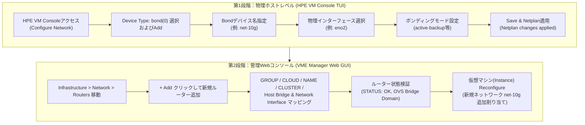

> **環境基準**: HPE Morpheus VM Essentials (VME) / HPE SimpliVity 6.2.0 (HVM 24.04 BaseOS)  
> **参照マニュアル**: HPE-VMネットワーク追加作業ガイド v2.0

---

HPE SimpliVity HVMやVME（VM Essentials）環境の初期セットアップ直後は、デフォルトの管理ネットワーク（Management）のみが構成されている状態です。実際の業務仮想マシン（VM）を本番稼働させるには、サービス用データネットワークや業務別VLANを追加する作業が不可欠となります。

作業の流れは大きく2段階に分かれます。まず物理ホストレベル（HPE VM Console TUI）でボンディングインターフェースを作成し、その後VME Manager WebコンソールでOVS（Open vSwitch）ルーターとして登録し、仮想マシンへ割り当てる手順です。

本記事では、TUIコンソールでのボンディング設定からVME Webコンソールでのルーターマッピング、VMへの割り当てまでの標準手順を整理しました。さらに、現場で物理ポートが1本（Single NIC）しか接続できない状況であっても、なぜ最初からボンディングで構成しておくべきなのかという実務的な理由と、OVS設定時のトラブルシューティングポイントを併せて解説します。

---

## 1. 全体作業ワークフロー

HVMホストに外部ネットワークを追加してVMに接続する構成は、物理ホスト層と仮想化管理層で明確に分離されています。



---

## 2. 実務設計原則：「シングルNIC（単一ポート）環境でもなぜボンディングで組むべきなのか」

現場導入を進めていると、上位L2/L3スイッチ側のポート手配が遅れていたり、ラック配線スケジュールの関係で、当面は物理ポート1本（`eno2`など）のみを接続してサービスを開始しなければならないケースがよくあります。

このとき最も陥りやすい失敗が、「どうせケーブルが1本だから」とデバイスタイプを単純な `ethernet` に設定し、OVSブリッジに直結してしまうことです。

> [!WARNING]
> **単一ethernetデバイスで直接構成した場合の問題点**  
> 将来スイッチ側のポートが確保され、2本目のケーブルを挿して冗長化（HA）を組もうとした際、既存のOVSブリッジと仮想マシンに接続されたネットワークマッピングをすべて削除し、再作成する必要があります。つまり、稼働中の仮想マシンに不要なサービス停止（ダウンタイム）が発生します。

### シングルポートでも `bond` (active-backup) でラップすべき実務上の理由

1. **無停止での冗長化拡張（Zero-Downtime HA）**  
   物理ポートが1本だけであっても、Device IDを `net-10g`、Modeを `active-backup` に指定し、`eno2` のみを束ねておきます。後から冗長化回線（`eno3`）が配線された際、上位のOVSブリッジやVM設定には一切手を加えることなく、単にBondメンバーへ `eno3` を追加するだけで即座に無停止冗長化が完了します。
2. **上位仮想化設定の不変性維持**  
   VME Manager Webコンソールは、上位の論理インターフェースである `net-10g`（Bond）のみを参照します。配下の物理NICが1本から2本に増設されたり別ポートに変更されたりしても、VME上のルーターマッピングやVMのvNIC設定はそのまま保持されます。
3. **運用の標準化**  
   すべての仮想化ノードでネットワークデバイス名を `bond` 命名規則（例: `bond0`, `net-10g`）で統一しておくことで、長期的な保守性やスクリプト運用の再現性が大幅に向上します。

> [!TIP]
> 物理ポートが今1本であろうと2本であろうと、HVMホストレベルでは常にデバイスタイプを `bond` とし、`active-backup` モードで組んでおくことが現場の安全な標準です。

---

## 3. [Part 1] HPE VM Console (TUI) ホストネットワークボンディング構成

HVMホストのコンソール（iLOリモートコンソールまたは物理ディスプレイ/キーボード）から、TUI環境であるHPE VM Consoleを通じてボンディングを作成します。

### Step 01. Configure Networkメニューへ進む
HPE VM Consoleの初期画面で方向キーを使用して `<Configure Network>` を選択し、Enterキーを押します。


### Step 02. Device Typeで `bond(0)` を選択し `<Add>`
Configure Network画面のDevice Typeドロップダウンから `bond(0)` を選択し、`<Add>` を押します。


### Step 03. ボンディングデバイス名（Device ID）の指定
Add Device画面でDevice Typeが `bond` であることを確認し、使用するDevice ID（例: `net-10g`）を入力して `<Continue>` をクリックします。


### Step 04. ボンディングに含める物理インターフェースの選択
Edit Device画面のBondタブで `[ ] interfaces` を選択し、ボンディングに束ねる物理インターフェース（例: `eno2`）をスペースキーでチェックして `<Done>` を押します。  
*(※ 物理ポートが1本のみの環境でも、`eno2` のみをチェックして進めます。)*


### Step 05. ボンディングモード（Bonding Mode）の設定
Edit parametersメニューでボンディングの動作モードを指定します。
* 一般的なアクティブ-スタンバイ構成やシングルNIC環境では、`mode: active-backup` を選択します。
* 上位スイッチ側ですでにLACPトランクが構成されている場合は、`802.3ad`（LACP）を選択します。
* 設定が完了したら `<Done>` を押します。


### Step 06. Netplan設定の保存（Save）
Configure Networkメイン画面に戻り、`<Save>` を押します。  
Netplan変更により接続が切断される可能性がある旨の確認ポップアップが表示されたら、`<Yes>` を選択します。


### Step 07. Netplan適用完了の確認
ホストLinuxのネットワークスタックに設定が正常に反映されると、`Netplan changes applied` メッセージが表示されます。`<OK>` を押してコンソール作業を終了します。


---

## 4. [Part 2] VME Manager Webコンソールでのルーター登録およびVM割り当て

ホストOSレベルで `net-10g` ボンディングインターフェースが有効化されたため、VME Manager Webコンソールでこれを論理ルーターとして登録し、仮想マシンに接続します。

### Step 08. Network > Routersメニューへの移動と `+ Add`
VME Manager（`https://<VME_Manager_IP>`）にログイン後、**[Infrastructure] -> [Network] -> [Routers]** メニューへ進み、右上の緑色の `[+ Add]` ボタンをクリックします。


### Step 09. ルーター情報の入力とHost Bridge / Interfaceマッピング
ADD NETWORK ROUTERモーダルで環境に合わせた情報を入力します。


* **GROUP**: 所属する管理グループ（例: `vme-grp`）
* **CLOUD**: 連携先のクラウド（例: `vme-cloud`）
* **NAME**: ルーターの識別名（例: `10g-net`）
* **CLUSTER**: 対象のHVMクラスター（例: `prod-cluster`）
* **HOST BRIDGE**: 作成するOVSブリッジ名（例: `10g-net`）
* **NETWORK INTERFACE**: [Part 1]で作成したボンディングインターフェース（例: `net-10` または検証用 `dummy0`）を選択します。

> [!CAUTION]
> **OVSブリッジ名の重複禁止**  
> ホスト内に既に存在するブリッジ名（管理用ブリッジの `mgmt` など）と重複した名前を指定すると、ブリッジ作成に失敗します。必ず一意なBridge名を指定してください。

### Step 10. ネットワークルーターの状態検証
登録完了後、Routers一覧に新しく追加されたルーターが表示されます。
* **STATUS**: 緑色のチェックアイコン（正常アクティブ）
* **NAME**: 指定したルーター名（`net-10g`）
* **ROUTER TYPE**: `OVS Bridge Domain`
* **GROUP**: 所属グループとのバインド確認


### Step 11. 仮想マシン（VM）への新規ネットワーク割り当て
仮想マシンに新しい仮想NICを接続します。
1. **[Provisioning] -> [Instances]** から対象のVMを選択します。
2. 画面右上のアクションメニューから `Reconfigure` をクリックします。
3. `NETWORKS` セクション右側の `+` ボタンをクリックします。
4. ドロップダウンから作成した `net-10g` を選択し、IP割り当て方式（DHCPまたはStatic）を指定します。
5. 右下の `[Reconfigure]` をクリックすると、VMに新しいvNICが動的にマウントされます。


---

## 5. SimpliVity VMEクラスター環境におけるネットワーク分離原則

単独のHVMノードとは異なり、**HPE SimpliVity 6.2.0 (HVM) クラスター環境**では、ストレージ専用トラフィックとの物理的分離が非常に重要です。

```
+-----------------------------------------------------------------------+
|                       HPE SimpliVity 物理ノード                         |
|                                                                       |
|  [ 専用 10G/25G PCIe NIC ] ------> SimpliVity OVC (ストレージコントローラー) |
|   - Storage Network (MTU 9000, VLAN 151) : リアルタイムブロック複製    |
|   - Federation Network (MTU 9000, VLAN 153) : クラスターメタデータ     |
|   ※ 一般VMトラフィックの混在は厳禁                                     |
|                                                                       |
|  [ オンボードLOM / 追加NIC (eno1〜eno4) ] --> 新規OVSボンディング (net-10g) |
|   - 一般業務仮想マシン(Workload VM) データサービストラフィック           |
+-----------------------------------------------------------------------+
```

1. **OVC専用ストレージ/フェデレーションインターフェースの分離**  
   SimpliVityのOmniStack Virtual Controller（OVC）は、リアルタイムのブロック複製やインライン重複排除/圧縮トラフィックを処理するため、10GbE専用ポート（`ens21f0np0`, `ens21f1np1`）とジャンボフレーム（MTU 9000）を占有します。業務VM用のネットワークを追加する際は、OVC専用NICを絶対に共有せず、オンボードLOM（`eno1`〜`eno4`）や業務専用の追加PCIe NICを分離してボンディングを組んでください。
2. **クラスターノード間での同一ブリッジ形状の維持**  
   ノード間のVMライブマイグレーションを正常に動作させるため、クラスターに属するすべての物理ノードに同一名称のボンディングインターフェースおよびOVSブリッジを事前に作成しておく必要があります。

---

## 6. 現場トラブルシューティング：OVSゴーストポートエラーの解消

仮想マシンの強制削除や構成変更時の異常終了により、OVSブリッジ上に不要な仮想インターフェースの残骸（Ghost Port）が残り、エラーを発生させることがあります。

ホストCLIで `ovs-vsctl show` を実行した際に、以下のようなエラーが出力されるケースです。

```text
root@vmemgr:/home/vmeadmin# ovs-vsctl show
4ea92630-835f-4664-83bc-01936dc54090
    Bridge mgmt
        fail_mode: standalone
        Port eno2
            Interface eno2
        Port vnet17
            Interface vnet17
                error: "could not open network device vnet17 (No such device)"
        Port vnet2
            Interface vnet2
                error: "could not open network device vnet2 (No such device)"
        Port vnet3
            Interface vnet3
                error: "could not open network device vnet3 (No such device)"
        Port mgmt
            Interface mgmt
                type: internal
```

この場合、該当ブリッジ（例: `mgmt`）からエラー対象の仮想ポートを手動で削除することで解消できます。

```bash
# エラーが発生している vnet ポートを削除
sudo ovs-vsctl del-port mgmt vnet17
sudo ovs-vsctl del-port mgmt vnet2
sudo ovs-vsctl del-port mgmt vnet3

# ブリッジ状態の再確認
ovs-vsctl show
```

削除後に再確認すると、エラー表示が消えて正常なポート（`eno2`, `mgmt` 等）のみが残ります。

---

## 7. まとめ

HPE VMEおよびSimpliVity環境におけるネットワーク拡張は、ホストレベルでのボンディング構成とVME WebコンソールでのOVSルーターマッピングが両輪となって機能します。

手順自体はシンプルですが、初期導入時に**「シングルポートであってもボンディングで組んでおく設計習慣」**と**「ストレージバックボーン回線の物理的分離原則」**を守っておくことで、将来のインフラ拡張や回線冗長化をサービス無停止でスムーズに実施できるようになります。
