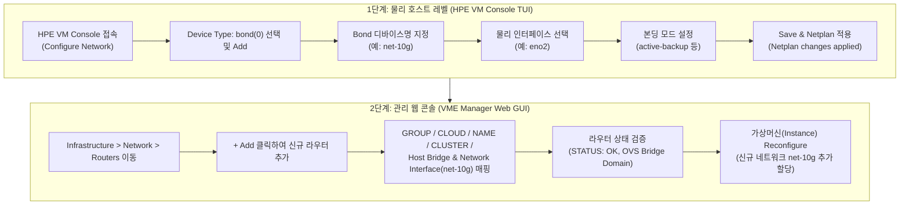

> **작성자**: 16년 차 IT 필드 엔지니어 (CK notes)  
> **기준 환경**: HPE Morpheus VM Essentials (VME) / HPE SimpliVity 6.2.0 (HVM 24.04 BaseOS)  
> **참조 매뉴얼**: HPE-VM 네트워크 추가 작업 가이드 v2.0

---

안녕하세요! 16년 차 IT 필드 시스템 엔지니어 **CK notes**입니다.

HPE VM Essentials(VME) 기반 가상화 인프라나 HPE SimpliVity HVM 환경을 구축하고 나면, 가상머신(VM)들을 실제 업무 서비스에 투입하기 위해 **기본 관리 네트워크(Management) 외에 서비스용 데이터 네트워크나 추가 업무망(VLAN)을 연결해야 하는 작업**이 반드시 필요합니다.

하지만 많은 엔지니어분들이 **"물리 호스트 레벨(HPE VM Console TUI)에서 본딩을 잡는 방법"**, **"VME Manager 웹 콘솔에서 OVS(Open vSwitch) 네트워크 라우터로 등록하는 절차"**, 그리고 **"단일 물리 포트만 연결 가능한 싱글 네트워크 환경에서는 어떻게 설계해야 추후 장애가 없는지"**에 대해 혼선을 겪곤 합니다.

이번 포스팅에서는 **HPE VM Console 기반 호스트 네트워크 본딩(Bond) 생성 7단계부터 VME Manager 웹 콘솔에서의 라우터 등록 및 VM 할당 4단계(총 11개 실전 스크린샷)**를 완벽 정리해 드립니다.  
또한, 16년 실무 현장에서 체득한 **"싱글 NIC 환경에서도 무조건 본딩으로 잡아야 하는 이유"**와 **OVS 고스트 포트 에러 트러블슈팅 노하우**까지 아낌없이 공개합니다!

---

## 1. HPE VME & SimpliVity 네트워크 추가 전체 워크플로우

HVM 호스트에 새로운 네트워크를 추가하여 가상머신에 연결하는 전체 흐름은 크게 **2개의 계층(물리 호스트 TUI ➔ VME 웹 콘솔)**으로 진행됩니다.



---

## 2. 16년 차 엔지니어의 핵심 실무 팁: "싱글 NIC(단일 포트)라도 무조건 본딩(Bonding)으로 구성하라!"

현장 구축을 진행하다 보면 상단 L2/L3 스위치 포트가 부족하거나, 랙 배선 작업 일정 차이로 인해 우선 **1개의 물리 포트(예: `eno2`)만 연결한 채 서비스를 오픈해야 하는 상황**을 자주 마주칩니다.

이때 많은 초급 엔지니어들이 쉽게 범하는 실수가 **"어차피 선이 하나니까 Device Type을 `ethernet`으로 잡아서 `eno2`를 OVS 브릿지에 다이렉트로 물려버리는 것"**입니다.

> [!WARNING]
> **🚨 싱글 NIC를 `ethernet` 단일 디바이스로 직접 구성했을 때 발생하는 치명적인 문제점**  
> 추후 스위치 포트가 확보되어 2차 케이블을 연결하고 **네트워크 이중화(HA)를 구성하려 할 때, 기존 OVS 브릿지와 가상머신 네트워크 설정을 모두 삭제하고 다시 만들어야 합니다.** 이는 필연적으로 **운영 중인 가상머신의 서비스 다운타임(Downtime)**을 유발합니다!

### 💡 싱글 포트라도 `bond` (active-backup)로 감싸야 하는 3가지 실무 이유

1. **무중단 동적 확장 (Zero-Downtime HA Scalability)**  
   처음에 물리 포트가 1개뿐이라도 `bond` (Device ID: `net-10g`, Mode: `active-backup`, Interface: `eno2`)로 생성해 두면, 추후 이중화 케이블(`eno3`)이 인입되었을 때 **OVS 브릿지나 가상머신 설정을 단 1초도 건드릴 필요 없이, 단순히 Bond 멤버 목록에 `eno3`를 추가하기만 하면 즉시 무중단 이중화가 완성**됩니다.
2. **OVS 브릿지 및 VME Manager 설정의 불변성 유지**  
   VME Manager 웹 콘솔에서는 상위 논리 인터페이스인 `net-10g` (Bond)만을 바라보고 있으므로, 하부의 물리 NIC가 1개에서 2개로 확장되거나 다른 포트로 스왑되더라도 VME 상의 라우터 매핑과 가상머신 vNIC 설정은 완전히 보존됩니다.
3. **인터페이스 장애 조치(Failover) 표준화**  
   엔터프라이즈 데이터센터 환경에서 모든 가상화 호스트의 네트워크 디바이스를 `bond` 네이밍 규칙(예: `bond0`, `net-10g`, `net-service`)으로 통일함으로써 유지보수 및 자동화 운영의 일관성이 확보됩니다.

> [!TIP]
> **📌 결론**: 물리 포트가 1개든 2개든, HVM 호스트 레벨에서는 **언제나 Device Type을 `bond`로 잡고 `active-backup` 모드로 구성**하는 것이 시스템 엔지니어의 정석입니다.

---

## 3. [Part 1] HPE VM Console (TUI) 호스트 네트워크 본딩(Bond) 구성 7단계

HVM 호스트의 콘솔(iLO Remote Console 또는 직접 연결된 모니터/키보드)에서 텍스트 기반 사용자 환경(TUI)인 **HPE VM Console**을 통해 네트워크 본딩을 생성합니다.

### Step 01. HPE VM Console 진입 & Configure Network 선택
HPE VM Console 초기 화면에서 방향키로 **`<Configure Network>`**를 선택하고 Enter를 누릅니다.


### Step 02. Device Type에서 `bond(0)` 선택 후 `<Add>`
Configure Network 화면의 `Device Type` 드롭다운에서 **`bond(0)`**을 선택한 후, 하단의 **`<Add>`** 버튼을 누릅니다.


### Step 03. 본딩 디바이스 이름(Device ID) 지정
`Add Device` 창이 열리면 `Device Type`이 `bond`로 지정된 것을 확인하고, 사용할 **Device ID(예: `net-10g` 또는 `bond1`)**를 입력한 뒤 **`<Continue>`**를 클릭합니다.


### Step 04. Bond에 포함할 물리 인터페이스 선택
`Edit Device` 화면의 `Bond` 탭에서 **`[ ] interfaces`** 항목을 선택하고, 본딩에 묶을 물리 인터페이스(예: **`eno2`**)를 스페이스바로 체크한 후 `<Done>`을 누릅니다.  
*(※ 앞서 말씀드린 팁처럼 물리 포트가 1개뿐이어도 eno2 하나만 체크하여 본딩을 생성합니다.)*


### Step 05. 본딩 모드(Bonding Mode) 설정
`Edit parameters` 메뉴에서 본딩 동작 방식을 지정합니다.
* 단일 스위치 이중화나 싱글 NIC 환경에서는 가장 안정적인 **`mode: active-backup`**을 선택합니다.
* 상단 스위치와 LACP 트렁크가 구성되어 있다면 `802.3ad` (LACP)를 선택합니다.
* 설정을 마쳤다면 하단의 **`<Done>`**을 클릭합니다.


### Step 06. Netplan 설정 저장(Save) 및 적용 확인
Configure Network 메인으로 돌아와 하단의 **`<Save>`**를 클릭합니다.  
"Netplan changes may result in a disconnect. Are you sure you want to continue?" 확인 팝업에서 **`<Yes>`**를 선택합니다.


### Step 07. Netplan 적용 완료 (Applied OK)
호스트의 리눅스 네트워크 스택에 Netplan 설정이 성공적으로 반영되면 **`Netplan changes applied`** 메시지가 출력됩니다. **`<OK>`**를 누르고 콘솔을 종료한 뒤 VME Manager 웹 콘솔로 이동합니다.


---

## 4. [Part 2] VME Manager 웹 콘솔에서 라우터 등록 & VM 할당 4단계

호스트 OS 레벨에서 `net-10g` 본딩 인터페이스가 활성화되었으므로, 이제 VM Essentials Manager 웹 콘솔에서 이를 논리 네트워크 라우터로 등록하고 가상머신에 연결합니다.

### Step 08. Infrastructure > Network > Routers 메뉴 진입 및 `+ Add` 클릭
웹 브라우저에서 VME Manager(`https://<VME_Manager_IP>`)에 로그인한 후, 상단 메뉴에서 **[Infrastructure] -> [Network] -> [Routers]** 탭으로 이동합니다. 우측 상단의 초록색 **`[+ Add]`** 버튼을 클릭합니다.


### Step 09. 라우터 정보 입력 및 Host Bridge / Interface 매핑
`ADD NETWORK ROUTER` 모달 창이 나타나면 각 항목을 다음과 같이 입력합니다:


* **GROUP**: 라우터가 속할 관리 그룹 선택 (예: `vme-grp`)
* **CLOUD**: 연동된 클라우드 환경 선택 (예: `vme-cloud`)
* **NAME**: VME 콘솔에서 식별할 라우터 이름 입력 (예: `10g-net`)
* **CLUSTER**: 대상 HVM 클러스터 선택 (예: `prod-cluster`)
* **HOST BRIDGE**: 생성할 Open vSwitch 브릿지 이름 입력 (예: `10g-net`)
* **NETWORK INTERFACE**: 드롭다운 목록에서 [Part 1]에서 생성한 본딩 인터페이스(예: **`net-10`** 또는 **`dummy0`**)를 선택합니다.

> [!CAUTION]
> **⚠️ OVS 브릿지 이름 중복 금지 (Bridge Name Conflict)**  
> OVS(Open vSwitch) 환경에서는 호스트 내에 이미 존재하는 브릿지 이름(예: 기본 관리 브릿지인 `mgmt`, 기존 생성된 `192-net` 등)과 동일한 이름을 지정하면 충돌이 발생하여 브릿지 생성이 실패합니다. 반드시 고유한 Bridge 이름을 부여하세요.

### Step 10. 생성된 네트워크 라우터 상태 검증
입력을 마치고 생성을 완료하면 Routers 목록에 방금 추가한 네트워크가 표시됩니다:
* **STATUS**: 초록색 체크 아이콘 (정상 활성화)
* **NAME**: `net-10g` (또는 지정한 라우터명)
* **ROUTER TYPE**: **`OVS Bridge Domain`**
* **GROUP**: 소속 그룹 정상 바인딩 확인


### Step 11. 가상머신 인스턴스(VM)에 신규 네트워크 할당
이제 가상머신에 새 네트워크를 붙여줄 차례입니다.
1. **[Provisioning] -> [Instances]**에서 네트워크를 추가할 VM을 선택합니다.
2. VM 상세 페이지 우측 상단의 액션 메뉴에서 **`Reconfigure`**를 클릭합니다.
3. `RECONFIGURE INSTANCE` 창의 **`NETWORKS`** 섹션에서 우측의 **`+`** 버튼을 누릅니다.
4. 추가된 네트워크 드롭다운에서 방금 생성한 **`net-10g`**를 선택하고, IP 할당 방식(DHCP 또는 Static IP)을 지정합니다.
5. 우측 하단의 **`[Reconfigure]`**를 클릭하면 VM에 새로운 가상 NIC(vNIC)가 즉시 마운트됩니다.


---

## 5. SimpliVity VME 환경 구축 시 특별 고려사항

일반 HVM 가상화 노드와 달리, **HPE SimpliVity 6.2.0 (HVM) 클러스터 환경**에서는 네트워크를 추가할 때 반드시 다음 사항을 준수해야 합니다.

```
+-----------------------------------------------------------------------+
|                       HPE SimpliVity 물리 노드                          |
|                                                                       |
|  [ 전용 10G/25G PCIe NIC ] ------> SimpliVity OVC (스토리지 컨트롤러)   |
|   - Storage Network (MTU 9000, VLAN 151) : 실시간 블록 복제           |
|   - Federation Network (MTU 9000, VLAN 153) : 클러스터 메타데이터      |
|   ※ 일반 VM 트래픽 침범 엄격 금지!                                    |
|                                                                       |
|  [ 온보드 LOM / 추가 NIC (eno1~eno4) ] --> 신규 OVS 본딩 (net-10g)   |
|   - 일반 업무용 가상머신(Workload VM) 데이터 서비스 트래픽             |
+-----------------------------------------------------------------------+
```

1. **OVC 전용 스토리지/페더레이션 인터페이스 격리 필수**  
   SimpliVity의 OmniStack Virtual Controller(OVC)는 실시간 인라인 중복제거, 압축 및 동기식 블록 미러링을 위해 10GbE 전용 포트(`ens21f0np0`, `ens21f1np1`)와 점보 프레임(MTU 9000)을 독점 사용합니다.  
   새로운 업무용 가상머신 네트워크를 추가할 때는 **절대 OVC 전용 스토리지 NIC를 공유하지 마시고**, 온보드 LOM 포트(`eno1`~`eno4`)나 업무 전용 추가 PCIe NIC를 분리하여 본딩을 구성해야 합니다.
2. **클러스터 전체 노드 동일 브릿지 형상 유지**  
   2노드(또는 멀티 노드) SimpliVity 클러스터에서는 가상머신의 실시간 vMotion(HA 마이그레이션)이 원활하게 동작하도록, **클러스터에 소속된 모든 물리 노드에 동일한 이름의 본딩 디바이스와 OVS 브릿지**가 생성되어 있어야 합니다.

---

## 6. 현장 트러블슈팅 & 고급 엔지니어링 팁

### 🛠️ 트러블슈팅 1: OVS 고스트 포트 에러 정리 (`could not open network device vnetX`)

가상머신을 삭제하거나 vNIC를 재구성하는 과정에서, 비정상 종료 등으로 인해 OVS 브릿지 상에 존재하지 않는 가상 인터페이스가 잔재(Ghost Port)로 남아 에러를 유발하는 경우가 있습니다.

호스트 CLI에서 `ovs-vsctl show`를 실행했을 때 아래와 같은 에러가 출력된다면:

```text
root@vmemgr:/home/vmeadmin# ovs-vsctl show
4ea92630-835f-4664-83bc-01936dc54090
    Bridge mgmt
        fail_mode: standalone
        Port eno2
            Interface eno2
        Port vnet17
            Interface vnet17
                error: "could not open network device vnet17 (No such device)"
        Port vnet2
            Interface vnet2
                error: "could not open network device vnet2 (No such device)"
        Port vnet3
            Interface vnet3
                error: "could not open network device vnet3 (No such device)"
        Port mgmt
            Interface mgmt
                type: internal
```

#### ✅ 해결 절차: `ovs-vsctl del-port`로 고스트 포트 제거
에러가 발생한 가상 포트를 해당 브릿지(예: `mgmt`)에서 수동으로 제거해 줍니다:

```bash
# 에러가 발생한 vnet 포트들을 순차적으로 삭제
sudo ovs-vsctl del-port mgmt vnet17
sudo ovs-vsctl del-port mgmt vnet2
sudo ovs-vsctl del-port mgmt vnet3

# 정리 후 OVS 브릿지 상태 재확인
ovs-vsctl show
```
정리 후 다시 `ovs-vsctl show`를 실행하면 에러 메시지가 말끔히 사라지고 정상 포트(`eno2`, `vnet0`, `vnet1`, `mgmt`)만 남게 됩니다.

---

### 💡 고급 팁 2: 사전 테스트를 위한 Linux Dummy 인터페이스 구성법

물리 스위치 패치가 완료되지 않았거나, 랩(Lab) 환경에서 VME Manager 라우터 등록 및 VM 네트워크 할당 흐름을 먼저 검증하고 싶을 때는 Linux의 **`dummy` 네트워크 모듈**을 활용하면 매우 유용합니다.

호스트 터미널에서 다음 명령어로 가상 더미 디바이스를 생성합니다:

```bash
# 1) dummy 커널 모듈 적재
sudo modprobe dummy

# 2) dummy 인터페이스 2개 생성
sudo ip link add dummy0 type dummy
sudo ip link add dummy1 type dummy

# 3) IP 주소 할당 (예시)
sudo ip addr add 10.10.10.1/32 dev dummy0
sudo ip addr add 10.10.20.1/32 dev dummy1

# 4) 인터페이스 활성화 (UP)
sudo ip link set dummy0 up
sudo ip link set dummy1 up
```

이렇게 구성하면 VME Manager의 `ADD NETWORK ROUTER` 모달에서 **`dummy0`**, **`dummy1`**이 즉시 인식되어, 실제 물리 케이블 없이도 완벽한 네트워크 사전 시뮬레이션 및 테스트가 가능합니다!

---

## 7. 결론 및 핵심 요약

HPE VME 및 SimpliVity 환경에서의 네트워크 추가는 **물리 레벨(HPE VM Console)에서의 표준화된 본딩 구성**과 **가상화 레벨(VME Manager)에서의 유연한 OVS 라우터 매핑**이 유기적으로 맞물려 완성됩니다.

### 📌 오늘의 핵심 요약 3가지
1. **싱글 NIC라도 무조건 본딩(active-backup) 구성**: 추후 물리 케이블 추가 시 서비스 중단(Zero-Downtime) 없이 즉시 이중화로 확장할 수 있는 필수 설계 전략입니다.
2. **OVS 브릿지 이름 유니크 관리**: 기존 관리 브릿지(`mgmt` 등)와 충돌하지 않도록 고유한 이름을 부여해야 합니다.
3. **SimpliVity 트래픽 분리 원칙**: OVC 전용 초고속 백본망(Storage/Federation MTU 9000)을 일반 업무용 VM과 공유하지 않고 물리적으로 분리합니다.

---

궁금하신 점이나 실무 현장에서 발생하는 네트워크 트러블슈팅 질문은 언제든 댓글로 남겨주세요!
