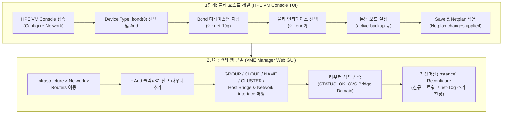

> **환경 기준**: HPE Morpheus VM Essentials (VME) / HPE SimpliVity 6.2.0 (HVM 24.04 BaseOS)  
> **참조 매뉴얼**: HPE-VM 네트워크 추가 작업 가이드 v2.0

---

HPE SimpliVity HVM이나 VME(VM Essentials) 환경을 처음 셋업하고 나면 기본 관리 네트워크(Management)만 구성된 상태입니다. 실제 업무용 가상머신(VM)들을 운영 환경에 투입하려면 서비스용 데이터 네트워크나 업무별 VLAN을 추가하는 작업이 필수적입니다.

작업 흐름은 크게 2단계로 나뉩니다. 먼저 물리 호스트 레벨(HPE VM Console TUI)에서 본딩 인터페이스를 생성하고, 이후 VME Manager 웹 콘솔에서 OVS(Open vSwitch) 라우터로 등록하여 가상머신에 할당하는 순서입니다.

이번 글에서는 TUI 콘솔에서의 본딩 설정부터 VME 웹 콘솔의 라우터 매핑 및 VM 할당까지의 표준 절차를 정리했습니다. 아울러 현장에서 단일 물리 포트(Single NIC)만 연결 가능한 상황이라도 왜 처음부터 본딩으로 묶어두어야 하는지 실무적인 이유와, OVS 설정 시 겪을 수 있는 트러블슈팅 포인트를 함께 정리합니다.

---

## 1. 전체 작업 워크플로우

HVM 호스트에 네트워크를 추가하여 VM에 연결하는 구조는 물리 호스트와 가상화 관리 계층으로 분리되어 있습니다.



---

## 2. 실무 설계 원칙: "싱글 NIC(단일 포트) 환경이라도 왜 본딩으로 잡아야 하는가?"

현장 구축을 진행하다 보면 상단 L2/L3 스위치 포트가 아직 준비되지 않았거나, 랙 배선 일정 문제로 우선 물리 포트 하나(`eno2`)만 연결한 채 서비스를 오픈해야 하는 상황을 자주 만납니다.

이때 가장 흔히 하는 실수가 "어차피 케이블이 하나니까" 디바이스 타입을 단순 `ethernet`으로 잡고 OVS 브릿지에 직결해버리는 것입니다.

> [!WARNING]
> **단일 ethernet 디바이스로 직접 구성 시 발생하는 문제**  
> 나중에 스위치 포트가 확보되어 2차 케이블을 꽂고 이중화(HA)를 구성하려 할 때, 기존 OVS 브릿지와 가상머신에 연결된 네트워크 매핑을 전부 삭제하고 다시 생성해야 합니다. 즉, 운영 중인 가상머신의 서비스 중단(다운타임)이 불가피해집니다.

### 싱글 포트라도 `bond` (active-backup)로 감싸야 하는 실무적인 이유

1. **무중단 이중화 확장 (Zero-Downtime HA)**  
   물리 포트가 1개뿐이라도 Device ID를 `net-10g`, Mode를 `active-backup`으로 지정한 뒤 `eno2` 하나만 묶어두면 됩니다. 추후 이중화 회선(`eno3`)이 들어왔을 때, 상위 OVS 브릿지나 VM 설정은 전혀 손댈 필요 없이 본딩 멤버에 `eno3`만 추가해주면 그 즉시 무중단으로 이중화가 완성됩니다.
2. **상위 가상화 설정의 불변성 유지**  
   VME Manager 웹 콘솔은 상위 논리 인터페이스인 `net-10g`(Bond)만 바라봅니다. 하부의 물리 NIC가 1개에서 2개로 늘어나거나 다른 포트로 바뀌더라도, VME 라우터 매핑과 가상머신 vNIC 설정은 그대로 유지됩니다.
3. **운영 표준화**  
   모든 가상화 노드의 네트워크 디바이스를 `bond` 명명 규칙(예: `bond0`, `net-10g`)으로 일원화해 두면, 장기적인 유지보수와 스크립트 기반 운영이 훨씬 수월해집니다.

> [!TIP]
> 물리 포트가 당장 1개이든 2개이든, HVM 호스트 레벨에서는 항상 디바이스 타입을 `bond`로 잡고 `active-backup` 모드로 구성하는 것이 안전한 실무 표준입니다.

---

## 3. [Part 1] HPE VM Console (TUI) 호스트 네트워크 본딩 구성

HVM 호스트 콘솔(iLO 원격 콘솔 또는 로컬 모니터/키보드)에서 TUI 환경인 HPE VM Console을 통해 본딩을 생성합니다.

### Step 01. Configure Network 메뉴 진입
HPE VM Console 초기 화면에서 방향키로 `<Configure Network>`를 선택하고 Enter를 누릅니다.


### Step 02. Device Type에서 `bond(0)` 선택 후 `<Add>`
Configure Network 화면의 Device Type 드롭다운에서 `bond(0)`을 선택한 후 `<Add>`를 누릅니다.


### Step 03. 본딩 디바이스 이름(Device ID) 지정
Add Device 창에서 Device Type이 `bond`인지 확인하고, 사용할 Device ID(예: `net-10g`)를 입력한 뒤 `<Continue>`를 클릭합니다.


### Step 04. 본딩에 포함할 물리 인터페이스 선택
Edit Device 화면의 Bond 탭에서 `[ ] interfaces` 항목을 선택하고, 본딩에 묶을 물리 인터페이스(예: `eno2`)를 스페이스바로 체크한 뒤 `<Done>`을 누릅니다.  
*(※ 물리 포트가 1개뿐인 환경이라도 `eno2` 하나만 선택하고 진행합니다.)*


### Step 05. 본딩 모드(Bonding Mode) 설정
Edit parameters 메뉴에서 본딩 동작 모드를 지정합니다.
* 일반적인 액티브-스탠바이 구성이나 싱글 NIC 환경에서는 `mode: active-backup`을 선택합니다.
* 상단 스위치와 LACP 트렁크가 사전에 잡혀 있다면 `802.3ad` (LACP)를 선택합니다.
* 설정을 마쳤다면 `<Done>`을 누릅니다.


### Step 06. Netplan 설정 저장(Save)
Configure Network 메인으로 돌아와 `<Save>`를 누릅니다.  
Netplan 변경 시 연결이 끊길 수 있다는 안내 팝업이 뜨면 `<Yes>`를 선택합니다.


### Step 07. Netplan 적용 완료 확인
호스트 리눅스 네트워크 스택에 설정이 반영되면 `Netplan changes applied` 메시지가 표시됩니다. `<OK>`를 누르고 콘솔 작업을 마칩니다.


---

## 4. [Part 2] VME Manager 웹 콘솔 라우터 등록 및 VM 할당

호스트 OS 레벨에서 `net-10g` 본딩 인터페이스가 활성화되었으므로, 이제 VME Manager 웹 콘솔에서 이를 논리 라우터로 등록하고 VM에 연결합니다.

### Step 08. Network > Routers 메뉴 진입 및 `+ Add`
VME Manager(`https://<VME_Manager_IP>`)에 로그인한 후, **[Infrastructure] -> [Network] -> [Routers]** 메뉴로 이동하여 우측 상단의 `[+ Add]` 버튼을 클릭합니다.


### Step 09. 라우터 정보 입력 및 Host Bridge / Interface 매핑
ADD NETWORK ROUTER 창에서 환경에 맞는 정보를 입력합니다.


* **GROUP**: 라우터가 속할 관리 그룹 (예: `vme-grp`)
* **CLOUD**: 연동된 클라우드 (예: `vme-cloud`)
* **NAME**: VME 콘솔에서 표시될 라우터 이름 (예: `10g-net`)
* **CLUSTER**: 대상 HVM 클러스터 (예: `prod-cluster`)
* **HOST BRIDGE**: 생성할 OVS 브릿지 이름 (예: `10g-net`)
* **NETWORK INTERFACE**: [Part 1]에서 생성한 본딩 인터페이스(예: `net-10` 또는 테스트용 `dummy0`)를 선택합니다.

> [!CAUTION]
> **OVS 브릿지 이름 중복 주의**  
> 호스트 내에 이미 존재하는 브릿지 이름(관리 브릿지인 `mgmt` 등)과 동일하게 지정하면 이름 충돌로 브릿지 생성이 실패합니다. 반드시 고유한 Bridge 이름을 사용해야 합니다.

### Step 10. 네트워크 라우터 상태 검증
등록을 마치면 Routers 목록에 새로 추가한 라우터가 나타납니다.
* **STATUS**: 초록색 체크 아이콘 (정상 활성화)
* **NAME**: 지정한 라우터명 (`net-10g`)
* **ROUTER TYPE**: `OVS Bridge Domain`
* **GROUP**: 소속 그룹 바인딩 상태 확인


### Step 11. 가상머신(VM)에 신규 네트워크 할당
이제 가상머신에 새 네트워크 인터페이스를 연결합니다.
1. **[Provisioning] -> [Instances]**에서 대상 VM을 선택합니다.
2. 우측 상단 액션 메뉴에서 `Reconfigure`를 클릭합니다.
3. `NETWORKS` 섹션 우측의 `+` 버튼을 클릭합니다.
4. 드롭다운에서 방금 생성한 `net-10g`를 선택하고, IP 할당 방식(DHCP 또는 Static)을 설정합니다.
5. 하단의 `[Reconfigure]`를 클릭하면 VM에 새로운 vNIC가 즉시 마운트됩니다.


---

## 5. SimpliVity VME 클러스터 환경에서의 네트워크 분리 원칙

일반 HVM 단독 노드와 달리, **HPE SimpliVity 6.2.0 (HVM) 클러스터 환경**에서는 네트워크를 구성할 때 스토리지 전용 트래픽과의 분리가 매우 중요합니다.

```
+-----------------------------------------------------------------------+
|                       HPE SimpliVity 물리 노드                          |
|                                                                       |
|  [ 전용 10G/25G PCIe NIC ] ------> SimpliVity OVC (스토리지 컨트롤러)   |
|   - Storage Network (MTU 9000, VLAN 151) : 실시간 블록 복제           |
|   - Federation Network (MTU 9000, VLAN 153) : 클러스터 메타데이터      |
|   ※ 일반 VM 트래픽 침범 엄격 금지                                     |
|                                                                       |
|  [ 온보드 LOM / 추가 NIC (eno1~eno4) ] --> 신규 OVS 본딩 (net-10g)   |
|   - 일반 업무용 가상머신(Workload VM) 데이터 서비스 트래픽             |
+-----------------------------------------------------------------------+
```

1. **OVC 전용 스토리지/페더레이션 인터페이스와 분리**  
   SimpliVity의 OmniStack Virtual Controller(OVC)는 실시간 블록 복제 및 압축/중복제거 트래픽을 처리하기 위해 10GbE 전용 포트(`ens21f0np0`, `ens21f1np1`)와 점보 프레임(MTU 9000)을 사용합니다.  
   새로운 업무용 가상머신 네트워크를 추가할 때는 OVC 전용 NIC를 건드리지 마시고, 온보드 LOM(`eno1`~`eno4`)이나 별도의 서비스 전용 PCIe NIC를 분리하여 본딩을 잡아야 합니다.
2. **클러스터 노드 간 동일 브릿지 형상 유지**  
   노드 간 VM 라이브 마이그레이션이 원활하게 동작하려면, 클러스터에 묶인 모든 물리 노드에 동일한 이름의 본딩 인터페이스와 OVS 브릿지가 사전에 구성되어 있어야 합니다.

---

## 6. 현장 트러블슈팅: OVS 고스트 포트 에러 정리

가상머신을 삭제하거나 vNIC를 재구성하는 과정에서 비정상 종료가 발생하면, OVS 브릿지 상에 삭제된 가상 인터페이스가 잔재(Ghost Port)로 남아 에러를 유발하는 경우가 있습니다.

호스트 CLI에서 `ovs-vsctl show`를 실행했을 때 아래처럼 `could not open network device` 에러가 출력되는 상황입니다.

```text
root@vmemgr:/home/vmeadmin# ovs-vsctl show
4ea92630-835f-4664-83bc-01936dc54090
    Bridge mgmt
        fail_mode: standalone
        Port eno2
            Interface eno2
        Port vnet17
            Interface vnet17
                error: "could not open network device vnet17 (No such device)"
        Port vnet2
            Interface vnet2
                error: "could not open network device vnet2 (No such device)"
        Port vnet3
            Interface vnet3
                error: "could not open network device vnet3 (No such device)"
        Port mgmt
            Interface mgmt
                type: internal
```

이 경우 에러가 찍힌 가상 포트를 해당 브릿지(예: `mgmt`)에서 직접 삭제해주면 깔끔하게 정리됩니다.

```bash
# 에러가 발생하는 vnet 포트 삭제
sudo ovs-vsctl del-port mgmt vnet17
sudo ovs-vsctl del-port mgmt vnet2
sudo ovs-vsctl del-port mgmt vnet3

# 브릿지 상태 재확인
ovs-vsctl show
```

정리 후 다시 확인해보면 에러 메시지가 사라지고 정상 포트(`eno2`, `mgmt` 등)만 남게 됩니다.

---

## 7. 정리하며

HPE VME 및 SimpliVity 환경에서의 네트워크 추가 작업은 호스트 레벨의 본딩 구성과 VME 웹 콘솔의 OVS 라우터 매핑이 핵심 축을 이룹니다.

절차 자체는 어렵지 않지만, 초기 셋업 단계에서 **싱글 포트라도 본딩으로 묶어두는 설계 습관**과 **스토리지 백본 트래픽의 물리적 격리 원칙**만 잘 지켜두면 이후 인프라 확장이나 회선 이중화 작업을 서비스 중단 없이 유연하게 처리할 수 있습니다.
