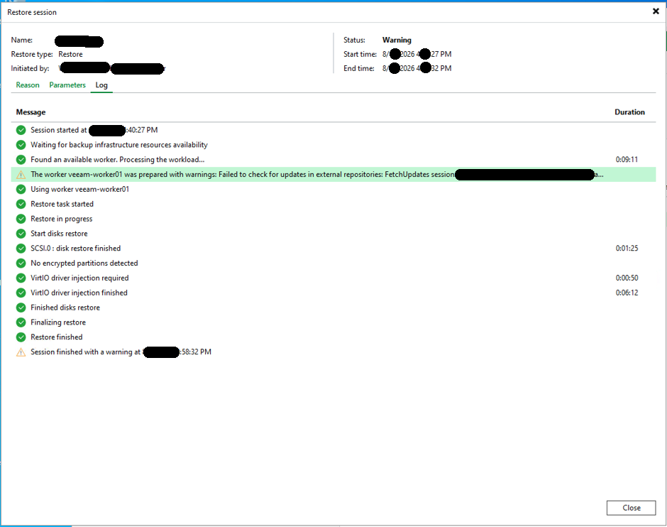
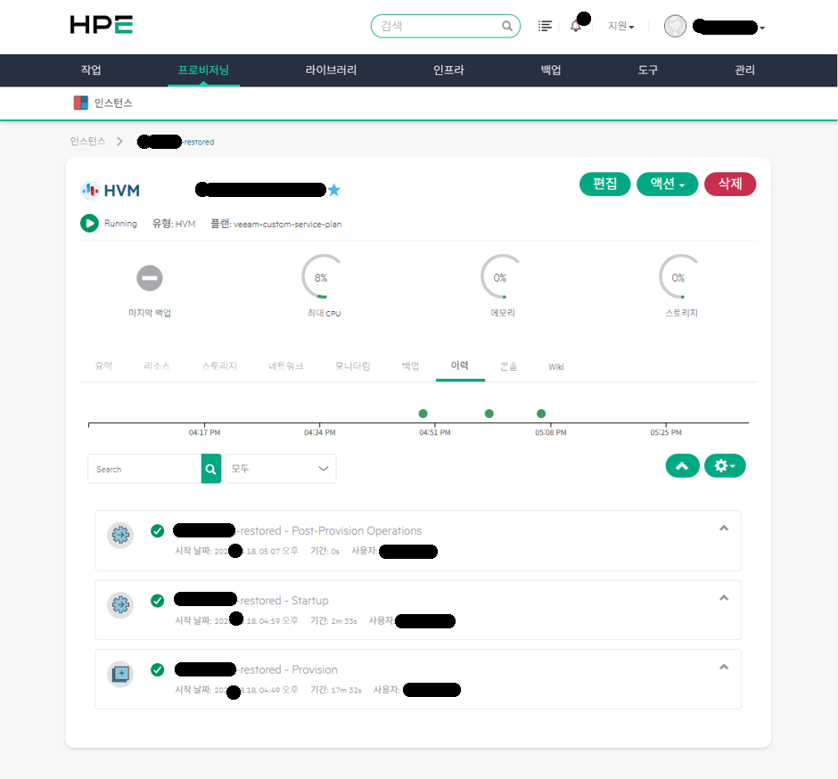
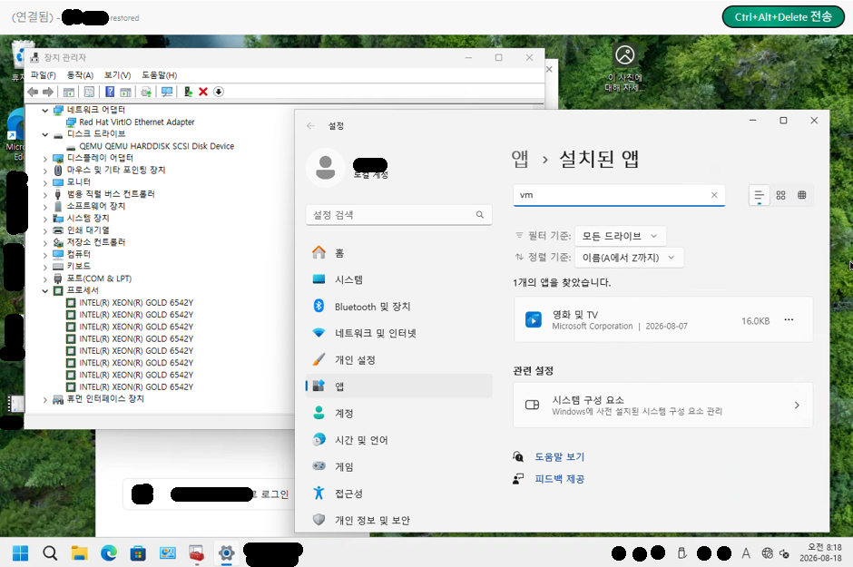

최근 엔터프라이즈 인프라 시장에서 VMware 라이선스 정책 변화에 대응하기 위해, KVM 기반의 **HPE VM Essentials(VME) 및 HPE SimpliVity HCI** 환경으로 가상머신을 전환하거나 이기종 재해복구(DR) 체계를 검토하는 사례가 급증하고 있습니다.

일반적으로 동일 하이퍼바이저 간의 마이그레이션은 네트워크 기반의 온라인 복제 솔루션을 활용합니다. 하지만 원격지나 폐쇄망 환경에서 **네트워크 대역폭이 10Mbps에 불과하다면** 실시간 네트워크 전송을 통한 온라인 복제는 물리적으로 불가능합니다. 수십 기가바이트(GB)에 달하는 VM 이미지를 10Mbps 회선으로 넘기려면 수십 시간 이상이 소요되기 때문입니다.

이러한 극단적인 제약 조건 속에서 취할 수 있는 가장 확실하고 실전적인 대안은, **기존 VMware 환경에서 백업받아 둔 Veeam의 백업 데이터 파일(`.vbk`)과 메타데이터 파일(`.vbm`)을 외장 저장장치로 물리 복사하여 타겟 시스템에 직접 마운트한 뒤 복구하는 오프라인 V2V(Virtual-to-Virtual) 복구 방식**입니다.

VMware vSphere에서 백업된 Windows 10 VM 파일을 타겟 Veeam 백업 인프라에 수동 임포트하고, KVM 기반 HPE VME 클러스터로 **단 18분 만에 완벽하게 부팅 및 서비스 정상화를 이뤄낸 실무 복구 과정과 핵심 기술 검증 내역**을 정리합니다.

---

### 실전 복구 환경 요약

| 항목 | 원본 환경 (Source) | 타겟 환경 (Target) |
| :--- | :--- | :--- |
| **하이퍼바이저** | VMware vSphere (ESXi) | HPE SimpliVity with HPE VME (KVM 기반 HVM) |
| **백업 솔루션** | Veeam Backup & Replication v11 | Veeam Backup & Replication (VME Worker 아키텍처) |
| **백업 파일 형식** | `.vbk` (Full Backup 데이터) + `.vbm` (백업 메타데이터) | 로컬 리포지토리 수동 복사 후 `Import Backup` |
| **네트워크 여건** | 원격지 간 **10Mbps** 극단적 대역폭 한계 (물리 파일 복사 불가피) | 타겟 내부 10G/25G 고속 인프라 |
| **대상 게스트 OS** | Windows 10 Pro (VMware Tools 설치 상태) | KVM VirtIO 드라이버 기반 정상 부팅 |

---

## 1. 10Mbps 대역폭의 한계와 오프라인 백업 파일 이관 전략

네트워크 회선 속도가 10Mbps로 제한된 환경에서는 데이터 전송 지연으로 인해 **RPO(복구 시점 목표, Recovery Point Objective)를** 실시간 수준으로 좁히는 데 명확한 한계가 존재합니다. 

따라서 비상 전환 시에는 네트워크 스트리밍을 포기하고, 원본 사이트의 백업 리포지토리에서 풀 백업 데이터 파일(`*.vbk`)과 함께 핵심 백업 메타데이터 파일(`*.vbm`)을 대용량 외장 스토리지에 복사하여 타겟 사이트의 로컬 백업 스토리지로 직접 이관하는 물리적 방식을 채택했습니다.

### 백업 메타데이터 파일(`.vbm`)이 필수적인 기술적 이유
여기서 수십 기가바이트의 `.vbk` 파일뿐만 아니라 수 킬로바이트(KB) 남짓한 **`.vbm`(Veeam Backup Metadata) 파일을 함께 복사하는 것이 핵심 노하우**입니다.
- **`.vbk` 단독 임포트 시**: 메타데이터가 없으면 타겟 Veeam은 거대한 `.vbk` 파일 내부의 전체 가상 디스크 블록 구조를 처음부터 스캔하고 카탈로그를 재구축해야 하므로, 복구 작업에 들어가기 전 인덱싱 단계에서 많은 시간을 허비하게 됩니다.
- **`.vbk` + `.vbm` 동시 복사 시**: `.vbm` 파일 내부에는 가상머신의 원본 하드웨어 사양, 디스크 지오메트리, 복원 지점 체인 구조가 완벽하게 저장되어 있습니다. 덕분에 원본 백업 서버의 데이터베이스와 완전히 단절된 독립 폐쇄망 환경이더라도, 타겟 Veeam 콘솔에서 `Import Backup`을 누르는 즉시 1초 만에 인벤토리에 등록되어 지체 없이 복구를 시작할 수 있습니다. 

---

## 2. Veeam Restore 세션: 이기종 복구의 핵심 'VirtIO Driver Injection'

가져온 백업 체인을 인식시킨 뒤, 복구 대상을 HPE VME(SimpliVity) 클러스터로 지정하고 Full VM Restore를 실행했습니다. 아래는 실제 복구 과정에서 기록된 Veeam Restore 세션의 상세 로그입니다.


*(사진: Veeam Restore 세션 로그 - KVM 전용 워커 구동, 디스크 복원, VirtIO 드라이버 주입 및 최종 완료 시간)*

### 복구 소요 시간 (RTO) 분석
- **세션 시작 시간**: `40분 27초 PM`
- **세션 완료 시간**: `58분 32초 PM`
- **순수 복구 소요 시간**: **약 18분 5초**

10Mbps 회선으로 네트워크 복제를 시도했다면 반나절 이상 걸렸을 작업이, 물리 복사본 기반의 로컬 인프라 복구를 통해 **단 18분 만에 인스턴스 배포까지 완료(RTO 달성)**되었습니다.

### 이기종 V2V 복구의 핵심: VirtIO 드라이버 주입
VMware 환경의 가상머신을 KVM 기반인 HPE VME로 복구할 때 가장 치명적인 문제는 **스토리지 컨트롤러 아키텍처의 불일치**입니다. 
- VMware: `LSI Logic SAS` 또는 `VMware Paravirtual(PVSCSI)` 컨트롤러 사용
- KVM(VME): 고성능 `VirtIO SCSI` 컨트롤러 사용

드라이버 변환 없이 그대로 부팅을 시도하면 Windows 부팅 로더가 부팅 디스크를 찾지 못해 **블루스크린(BSOD 0x7B: Inaccessible Boot Device)**을 발생시키며 무한 재부팅에 빠지게 됩니다.

Veeam은 이 문제를 해결하기 위해 로그에 나타난 것처럼 전용 KVM 프록시(`veeam-worker01`)를 기동하여 백그라운드에서 오프라인 윈도우 OS의 레지스트리와 시스템 폴더에 직접 드라이버를 주입합니다:
```text
VirtIO driver injection required (0:00:50)
VirtIO driver injection finished (0:06:12)
```
약 6분 동안 오프라인 상태의 Windows 시스템 이미지 내부로 **Red Hat KVM VirtIO 스토리지 및 네트워크 드라이버를 완벽하게 인젝션(Injection)**하여, 부팅 시 즉각 디스크를 읽어 들일 수 있도록 밑작업을 자동으로 완료해 준 것입니다.

---

## 3. HPE VME Manager: HVM 인스턴스 프로비저닝 및 기동 검증

Veeam의 복구 프로세스가 마무리되면, 타겟 가상화 관리 플랫폼인 **HPE VM Essentials(VME) Manager** 웹 콘솔에서 새로 배포된 인스턴스의 라이프사이클을 확인할 수 있습니다.


*(사진: HPE VME 콘솔에서 veeam-custom-service-plan으로 자동 프로비저닝되어 Running 중인 HVM 인스턴스)*

- **인스턴스 상태**: `Running` (정상 가동)
- **가상화 유형**: `HVM` (KVM 기반 고성능 하드웨어 가상머신)
- **서비스 플랜**: `veeam-custom-service-plan` (Veeam API를 통해 원본 VM 스펙에 맞춤 자동 매핑)
- **이력(History) 타임라인**:
  - `Provision`: 약 17분 32초 (Veeam 워커를 통한 디스크 생성 및 변환 완료)
  - `Startup`: 약 2분 33초 (VME 하이퍼바이저 상에서 인스턴스 최초 파워온 완료)
  - `Post-Provision Operations`: 즉시 완료

Veeam과 VME 플랫폼 간의 연동을 통해 수동으로 VM 스펙(vCPU, vRAM, 디스크 버스)을 생성할 필요 없이, 원본 백업 파일의 사양 그대로 정확하게 인스턴스가 프로비저닝되었습니다.

---

## 4. 게스트 OS 정밀 검증: 드라이버 상태 및 VMware Tools 정리 확인

복구의 진정한 성공 여부는 게스트 OS(Windows 10) 부팅 후 내부 하드웨어 드라이버 인식 상태와 소프트웨어 충돌 유무에서 결정됩니다. VME 콘솔을 통해 복구된 인스턴스의 화면으로 진입했습니다.


*(사진: VirtIO 네트워크/SCSI 디스크 정상 인식, 물리 CPU 통과, VMware Tools가 깔끔하게 정리된 게스트 OS)*

장치 관리자와 설치된 프로그램 목록에서 확인된 세 가지 결정적 성공 팩트는 다음과 같습니다:

1. **Red Hat VirtIO 드라이버의 완벽한 활성화**:
   - 네트워크 어댑터: **`Red Hat VirtIO Ethernet Adapter`**로 정상 로드.
   - 디스크 드라이브: **`QEMU QEMU HARDDISK SCSI Disk Device`**로 정상 로드.
   - 노란색 느낌표나 인식 불가 장치 없이 모든 핵심 I/O 컨트롤러가 정상 구동되었습니다.
2. **최신 SimpliVity 물리 CPU 스펙 통과**:
   - 프로세서 항목에서 타겟 SimpliVity 노드의 물리 프로세서인 **`Intel Xeon Gold 6542Y`**가 정상 매핑되어 고성능 연산 자원을 온전히 활용하고 있습니다.
3. **VMware Tools의 클린한 정리**:
   - `설정 > 앱 > 설치된 앱` 검색 결과, 기존 ESXi 환경에서 설치되어 있던 **VMware Tools 서비스가 부팅 및 드라이버 구동 과정에서 충돌을 일으키지 않고 깔끔하게 정리**되어 있습니다.
   - 이종 가상화 전환 시 흔히 발생하는 백그라운드 데몬 오류나 가상 디스플레이 깜빡임 문제 없이 아주 매끄러운 윈도우 바탕화면 진입을 확인했습니다.

---

## 5. 16년 차 시스템 엔지니어의 실무 결론

1. **극단적인 원격지 대역폭(10Mbps)에서는 물리 백업 이관이 정답입니다**:  
   네트워크 복제만을 고집하다가는 비상 상황에서 마이그레이션 골든타임을 놓치기 쉽습니다. 데이터 변경 분이 적거나 사전 계획된 전환이라면, 검증된 풀 백업 데이터(`.vbk`)와 백업 메타데이터(`.vbm`) 파일을 물리적으로 확보하여 다이렉트 임포트하는 것이 훨씬 안전하고 예측 가능한 복구 경로를 제공합니다.
2. **이종 하이퍼바이저(V2V) 복구 시 사전 드라이버 인젝션 검증은 필수입니다**:  
   VMware에서 KVM(VME)으로 넘어갈 때 가장 큰 복병인 0x7B 블루스크린을 예방하려면, 복구 솔루션이 오프라인 디스크에 VirtIO 드라이버를 주입할 수 있는지 반드시 사전 점검해야 합니다. 이번 사례처럼 Veeam의 내장 인젝션 기능이 정상 작동한다면 18분이라는 짧은 시간 안에 완벽한 부팅을 보장받을 수 있습니다.
3. **복구 후 디바이스 관리자 점검 루틴**:  
   OS 기동 후에는 반드시 장치 관리자에서 스토리지/네트워크 컨트롤러가 VirtIO로 정상 인식되었는지, 기존 하이퍼바이저 툴(VMware Tools 등)의 잔재가 드라이버 레벨에서 충돌을 일으키지 않는지 최종 검증하는 습관이 중요합니다.
