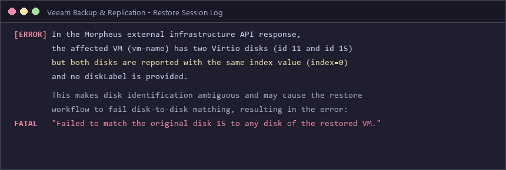
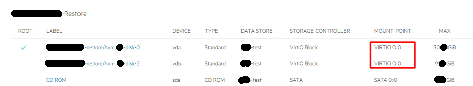
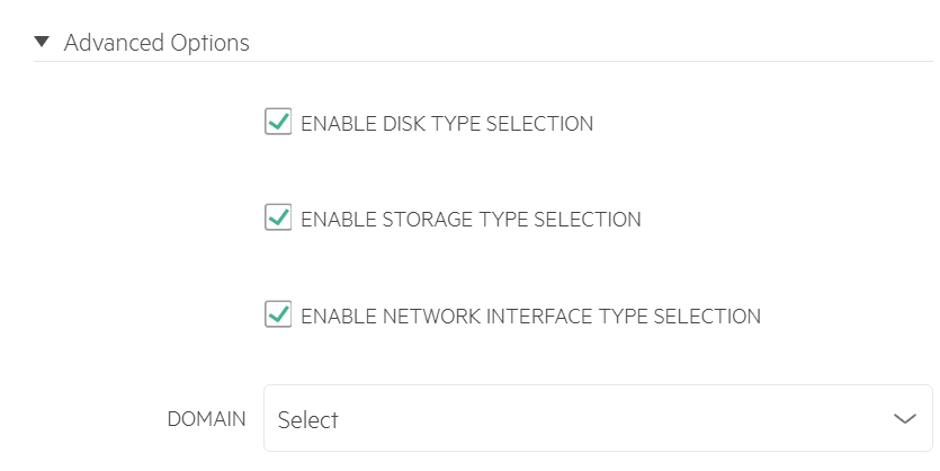
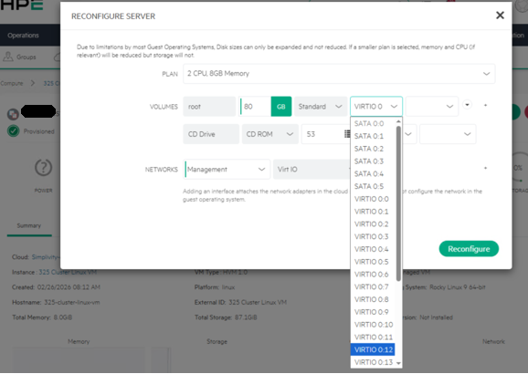

Following the deployment of KVM-based **HPE VM Essentials (VME) and HPE SimpliVity HCI**, integrating **Veeam Backup & Replication** for image-level backups and disaster recovery verification drills is a critical operational procedure to ensure enterprise service continuity.

However, when performing full image restores for **multi-disk virtual machines** (VMs with two or more virtual disks, such as separate OS and data volumes), administrators may encounter an unexpected restore blockage caused by disk index collisions.

This article details the root cause of the **Veeam VirtIO disk matching failure in HPE VME and demonstrates how to unlock the hidden Cloud Advanced Options in VME Manager to reassign unique VirtIO bus indexes**.

---

## 1. Symptoms & Veeam Restore Session Error Log

During a scheduled restore verification drill of a multi-disk VM backed up from HPE VME, the Veeam Full VM Restore workflow stalled and returned the following infrastructure API error:



```text
In the Morpheus external infrastructure API response,
the affected VM (vm-name) has two Virtio disks (id 11 and id 15)
but both disks are reported with the same index value (index=0)
and no diskLabel is provided.

This makes disk identification ambiguous and may cause the restore
workflow to fail disk-to-disk matching, resulting in the error:
“Failed to match the original disk 15 to any disk of the restored VM.”
```

### Analysis of the Failure
1. **Morpheus-Driven API Layer**: HPE VME Manager utilizes the Morpheus orchestration engine beneath its cloud management API layer.
2. **Duplicate Disk Indexing (`index=0`)**: The API reported both attached VirtIO disks (`id 11` and `id 15`) with the identical index value `0` and without distinct disk labels.
3. **Ambiguous Disk Matching**: Because Veeam's restore engine requires deterministic 1:1 disk mapping between source backup definitions and target VM volumes, the duplicate index rendered `disk 15` unmatchable, aborting the restore.

---

## 2. Inspecting VME Manager: Duplicate Mount Points (VIRTIO 0:0)

Navigating to the affected VM's storage configuration within the HPE VME Manager console revealed the direct root cause:


*(Figure: Both virtual disks vda and vdb assigned the exact same MOUNT POINT: VIRTIO 0:0)*

- **Disk 0 (`vda`)**: Storage Controller `VirtIO Block` / Mount Point **`VIRTIO 0:0`**
- **Disk 2 (`vdb`)**: Storage Controller `VirtIO Block` / Mount Point **`VIRTIO 0:0`**

Even though Linux recognizes the block devices sequentially at the kernel level (`vda`, `vdb`), **both disks were pinned to controller index `VIRTIO 0:0` at the hypervisor configuration layer**. For Veeam, which relies on strict hypervisor API metadata rather than in-guest device naming, this duplicate bus position creates an unresolvable collision.

---

## 3. The Solution: Unlocking Hidden VirtIO Bus Options in Cloud Settings

When attempting to fix the issue directly via `Reconfigure Server` on the VM, the dropdown menu for changing the VirtIO mount point is initially greyed out or completely unavailable under default platform settings.

To make the VirtIO bus numbering editable, administrators must **first enable disk and storage type selection policies at the parent Cloud configuration level**.

### Step 1. Enable Cloud Advanced Options

Navigate to the infrastructure cloud settings within the HPE VME console:
`Infrastructure > Clouds > Select your SimpliVity Cloud > Edit`

Expand the **Advanced Options** dropdown near the bottom of the page, check the following options, and save:


*(Figure: Enabling DISK TYPE SELECTION and STORAGE TYPE SELECTION under Cloud Advanced Options)*

- **`[x] ENABLE DISK TYPE SELECTION`**
- **`[x] ENABLE STORAGE TYPE SELECTION`**
- **`[x] ENABLE NETWORK INTERFACE TYPE SELECTION`**

---

## 4. Reconfiguring the Server: Reassigning VirtIO Numbering (VIRTIO 0:1)

With the cloud-level policies saved, return to the VM instance management view:
`Select VM > Actions > Reconfigure Server`

Under the **VOLUMES** section, the controller type and mount point dropdowns are now fully exposed and interactive.


*(Figure: Selecting a distinct mount point such as VIRTIO 0:1 for the secondary disk)*

1. **Root OS Disk (`vda`)**: Maintain the primary mount point **`VIRTIO 0:0`**.
2. **Secondary Data Disk (`vdb`)**: Open the dropdown and select an unused, unique index such as **`VIRTIO 0:1`**.
3. Click **`Reconfigure`** at the bottom right to apply changes.

Once applied, the storage table will show `vda` mapped to `VIRTIO 0:0` and `vdb` mapped to `VIRTIO 0:1`.

---

## 5. Verification & Successful Veeam Restore

With unique VirtIO bus addresses assigned, verify the operational loop:

1. **Initiate New Veeam Backup**: The VME API correctly presents `index=0` and `index=1` for the respective disks in its infrastructure payload.
2. **Execute Full VM Restore**:
   - Veeam's restore engine achieves seamless 1:1 disk matching for both volumes.
   - The error `Failed to match the original disk 15 to any disk of the restored VM` is completely eliminated, and the restore finishes successfully.

---

## 6. Key Takeaways & Best Practices

1. **Always audit disk bus layouts on multi-disk templates**:  
   In KVM/QEMU-based virtualization platforms, multi-disk instances created from certain legacy templates or quick provisioning steps can inadvertently share controller positions (`0:0`). Even if guest OS boots normally, third-party backup and replication tools will choke at the API layer.
2. **Explore parent cloud policies when options are missing**:  
   HPE VME streamlines cloud operations by concealing lower-level hardware controls by default. Whenever granular disk, NIC, or bus controller options appear locked, inspect the parent **`Cloud > Advanced Options`** configuration.
